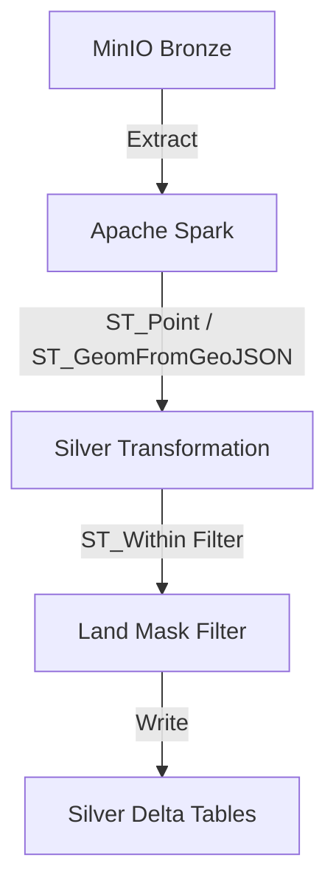

# Spec: Silver Layer Spatial Transformations
**Status:** IMPLEMENTED
**Author:** GeoAI Engineering

## Requirements
- Perform spatial transformation from Bronze ingested data to Silver Delta tables.
- Implement ST_Point and ST_GeomFromGeoJSON for all incoming geometries.
- Apply Land Mask filtering (ST_Within) using NYC Neighborhood Tabulation Areas.

## Architecture

## Acceptance Criteria (TDD/E2E)
- [ ] 100% test coverage for `src/silver_sedona_transform.py`.
- [ ] Zero skips in integration tests.
- [ ] No mocking of Spark transformations.
