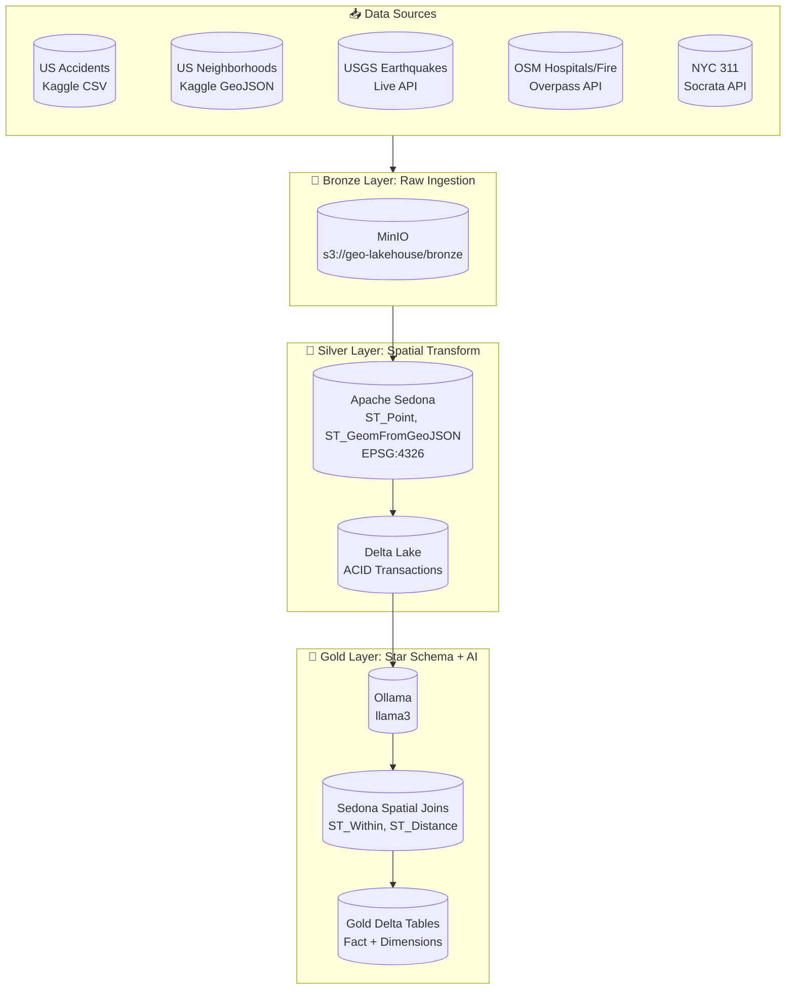
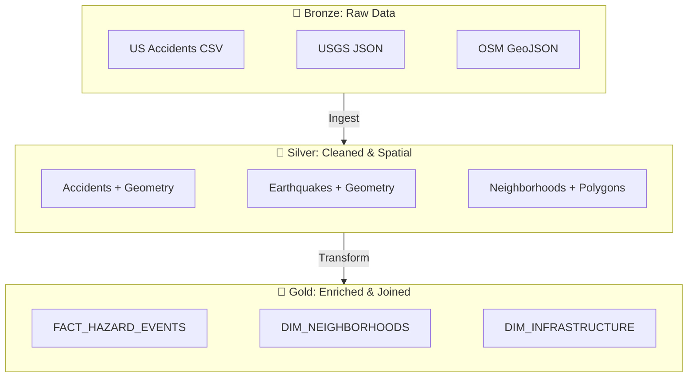
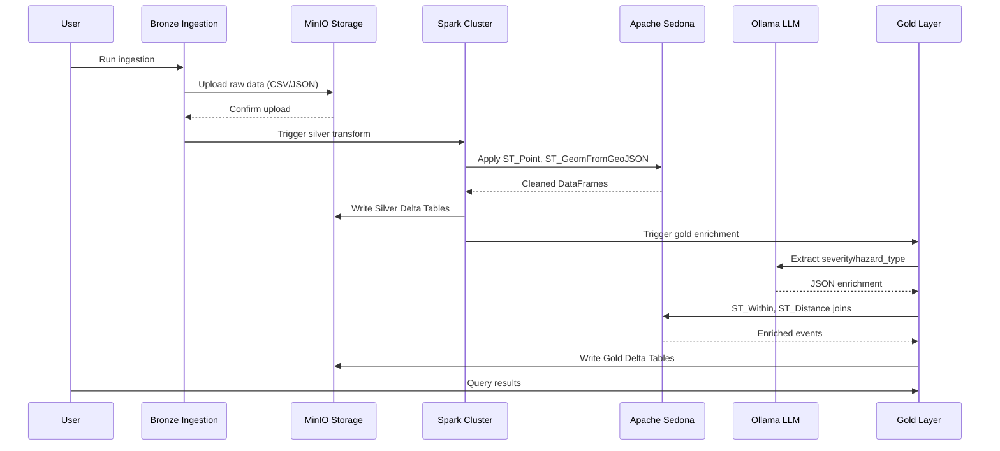
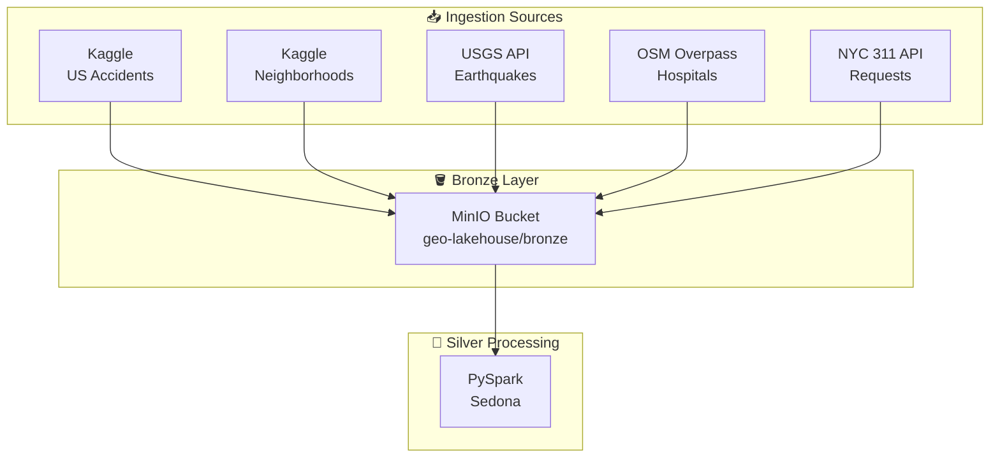
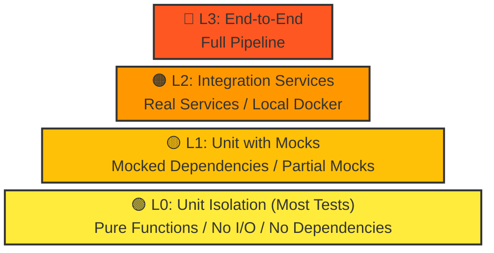

# GeoAI Medallion Architecture Pipeline

<p align="center">
  
  
  
  
  
</p>

A production-ready **Local Databricks Clone** for GeoAI portfolio projects using Medallion Architecture with Apache Spark, Apache Sedona, Delta Lake, MinIO, and local LLM integration.

---

## Table of Contents

1. [Architecture Overview](#architecture-overview)
2. [Tech Stack](#tech-stack)
3. [Data Flow](#data-flow)
4. [Getting Started](#getting-started)
5. [Pipeline Components](#pipeline-components)
6. [Testing Pyramid](#testing-pyramid)
7. [Deployment](#deployment)
8. [Troubleshooting](#troubleshooting)
9. [API References](#api-references)

---

## Architecture Overview

### High-Level System Architecture



### Medallion Architecture Layers



---

## Tech Stack

| Component | Technology | Version | Purpose |
|-----------|------------|---------|---------|
| **Compute Engine** | Apache Spark (PySpark) | 3.5.0 | Distributed processing |
| **Spatial Engine** | Apache Sedona | 1.5.0 | Geospatial SQL on Spark |
| **Storage** | Delta Lake | 3.1.0 | ACID on data lake |
| **Object Storage** | MinIO | Latest | S3-compatible storage |
| **Database** | PostgreSQL | 15 | Hive Metastore + MLflow |
| **MLOps** | MLflow | 2.10.0 | Experiment tracking |
| **LLM** | Ollama | Latest | Local LLM inference |

---

## Data Flow

### Pipeline Execution Flow



### Data Source Integration



---

## Getting Started

### Prerequisites

```bash
# Core requirements
Docker >= 20.10
Docker Compose >= 2.0
Python >= 3.9
8GB RAM (16GB recommended)
```

### Quick Start

```bash
# 1. Clone and navigate
cd geo-ai-medallion-architecture-pipeline

# 2. Copy environment template
cp .env.example .env

# 3. Start infrastructure
docker compose up -d

# 4. Verify services
./scripts/run_pipeline.sh status

# 5. Run ingestion (Bronze)
python src/bronze_ingestion.py

# 6. Run Silver transform
spark-submit src/silver_sedona_transform.py

# 7. Run Gold enrichment
spark-submit src/gold_schema_and_ai_enrichment.py
```

### Service Ports

| Service | Port | URL |
|---------|------|-----|
| Spark UI | 9080 | http://localhost:9080 |
| MinIO Console | 9901 | http://localhost:9901 |
| PostgreSQL | 5434 | localhost:5434 |
| Ollama | 11434 | http://localhost:11434 |

---

## Pipeline Components

### 1. Bronze Layer (Ingestion)

**File:** `src/bronze_ingestion.py`

```python
# Key functions
def fetch_usgs_earthquakes(config, days_back=30, min_magnitude=2.0):
    """Fetch from USGS FDSN Web Services API"""

def fetch_osm_infrastructure(config, bbox=(-125, 24, -66, 50)):
    """Fetch hospitals/fire stations via Overpass API"""

def fetch_nyc_311_requests(config, limit=100000):
    """Fetch 311 service requests from Socrata"""
```

**Output:** Raw JSON/CSV in `s3://geo-lakehouse/bronze/`

---

### 2. Silver Layer (Spatial Transform)

**File:** `src/silver_sedona_transform.py`

```python
# Key transformations
def create_geometry_from_latlon(df, lat_col, lon_col):
    """ST_Point - Convert lat/lng to geometry"""
    return df.withColumn(
        "geometry",
        F.expr("ST_Point(cast(lon as double), cast(lat as double))")
    )

def parse_geojson_geometry(df, geojson_col):
    """ST_GeomFromGeoJSON - Parse GeoJSON polygons"""
```

**Output:** Delta Tables in `s3://geo-lakehouse/silver/`

---

### 3. Gold Layer (AI + Spatial Joins)

**File:** `src/gold_schema_and_ai_enrichment.py`

```python
# AI Enrichment UDF
def create_ollama_enrichment_udf(config):
    @pandas_udf("string")
    def ollama_hazard_udf(text_series):
        return text_series.apply(analyze_hazard)
    return ollama_hazard_udf

# Spatial Joins
def spatial_join_events_to_neighborhoods(fact_df, dim_neighborhoods):
    """ST_Within - Point in Polygon"""
    return fact_df.join(
        dim_neighborhoods,
        F.expr("ST_Within(fact.geometry, dim.geometry)")
    )
```

**Output:** Star Schema in `s3://geo-lakehouse/gold/`

---

## Testing Pyramid

This project follows the **test pyramid** methodology with four levels of testing:



### Test Levels

| Level | File | Purpose | Dependencies |
|-------|------|---------|--------------|
| **L0** | `tests/L0.py` | Unit isolation, config, utils | None (mocked) |
| **L1** | `tests/L1.py` | Component integration | Mocked Spark/MinIO |
| **L2** | `tests/L2.py` | Pipeline stages | Docker services |
| **L3** | `tests/L3.py` | Full E2E | All running services |

### Running Tests

```bash
# All tests
python -m pytest tests/ -v

# By level
python -m pytest tests/L0.py -v  # Unit tests
python -m pytest tests/L1.py -v  # Integration
python -m pytest tests/L2.py -v  # Pipeline
python -m pytest tests/L3.py -v  # E2E
```

### Test Coverage Goals

```
L0: 80%+ (most tests - fast, no I/O)
L1: 15% (component integration)
L2: 4% (pipeline validation)
L3: 1% (smoke tests)
```

---

## Deployment

### Docker Compose Services

```yaml
services:
  spark:
    image: jupyter/pyspark-notebook:spark-3.5.0
    ports:
      - "9077:7077"  # Spark driver
      - "9080:8080"   # Spark UI
      
  minio:
    image: minio/minio:latest
    ports:
      - "9900:9000"
      - "9901:9001"
      
  postgres:
    image: postgres:15-alpine
    ports:
      - "5434:5432"
      
  ollama:
    image: ollama/ollama:latest
    ports:
      - "11434:11434"
```

### Environment Variables

```bash
# Required
export MINIO_ROOT_USER=minioadmin
export MINIO_ROOT_PASSWORD=minioadmin123
export POSTGRES_DB=geometastore
export POSTGRES_USER=geoai
export POSTGRES_PASSWORD=geoi_secure_pass_2024

# Optional (for Kaggle)
export KAGGLE_USERNAME=your_username
export KAGGLE_API_KEY=your_api_key
```

---

## Troubleshooting

### Common Issues

| Issue | Solution |
|-------|----------|
| Spark not connecting to MinIO | Check MinIO endpoint in config |
| Ollama API timeout | Increase `OLLAMA_TIMEOUT` |
| Sedona functions not found | Ensure Sedona plugin registered |
| Null geometries after transform | Check lat/lon column names |

### Debug Commands

```bash
# Check Spark logs
docker compose logs spark

# Test MinIO connectivity
docker exec geoai-spark python -c "import boto3; print('OK')"

# Verify Delta tables
spark.read.format("delta").load("s3://bucket/table").printSchema()
```

---

## API References

### Sedona Spatial Functions

```python
# Point from coordinates
ST_Point(longitude, latitude)

# GeoJSON to geometry
ST_GeomFromGeoJSON(geojson_string)

# Point in polygon
ST_Within(point_geom, polygon_geom)

# Distance between geometries (meters)
ST_Distance(point1, point2)

# Set CRS
ST_SetSRID(geometry, 4326)
```

### Delta Lake Operations

```python
# Read
spark.read.format("delta").load("s3://bucket/table")

# Write
df.write.format("delta").mode("overwrite").save("s3://bucket/table")

# Time travel
spark.read.format("delta").option("versionAsOf", 1).load("s3://bucket/table")
```

---

## Contributing

1. Fork the repository
2. Create a feature branch
3. Add tests (follow the pyramid)
4. Ensure L0 tests pass
5. Submit a PR

---

## License

Apache 2.0 - See LICENSE file for details.

---

## Credits

- [Apache Sedona](https://sedona.apache.org/) - Geospatial SQL on Spark
- [Delta Lake](https://delta.io/) - ACID transactions on data lakes
- [Ollama](https://ollama.ai/) - Local LLM inference

---

<p align="center">
  Built with ❤️ for GeoAI Portfolio Projects
</p>
