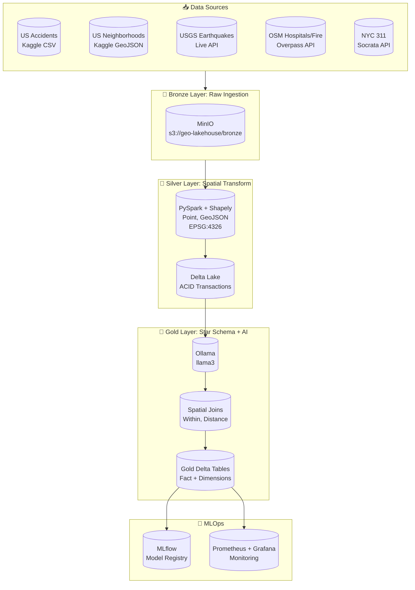
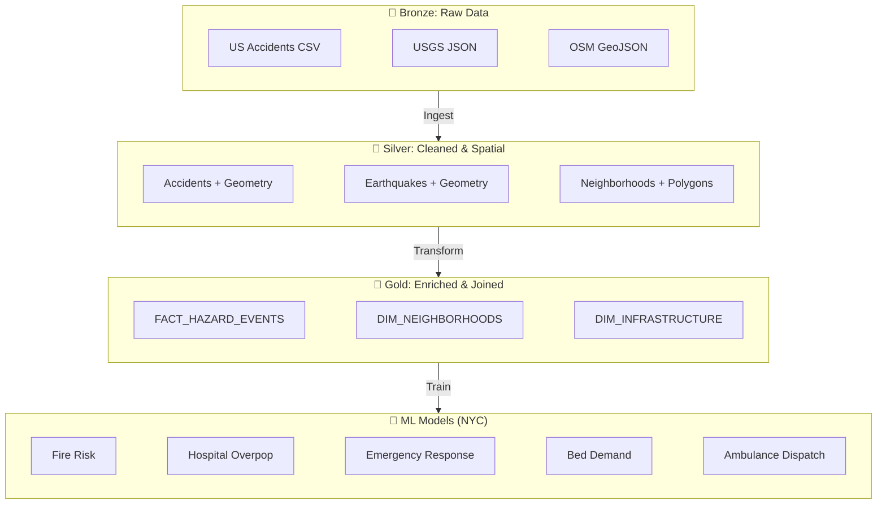
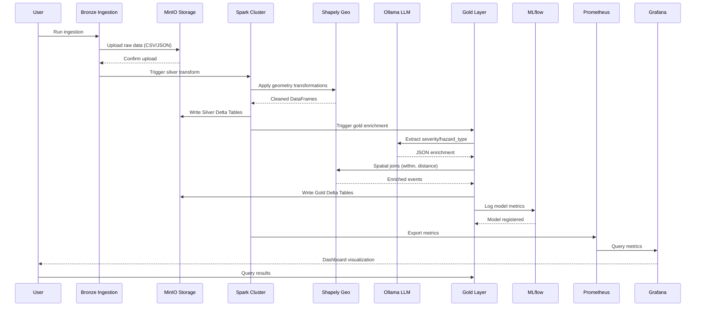
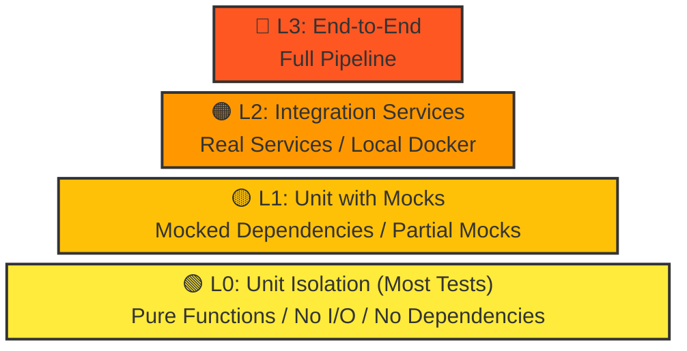

# GeoAI Medallion Architecture Pipeline

<p align="center">
  
  
  
  
  
  
  
  
</p>

A production-ready **Local Databricks Clone** for GeoAI portfolio projects using Medallion Architecture with Apache Spark, Delta Lake, MinIO, MLflow, Prometheus, Grafana, and local LLM integration.

---

## Table of Contents

1. [Architecture Overview](#architecture-overview)
2. [Tech Stack](#tech-stack)
3. [NYC Healthcare/Fire Models](#nyc-healthcarefire-models)
4. [Data Flow](#data-flow)
5. [3D Visualization & Digital Twin](#3d-visualization--digital-twin)
6. [Getting Started](#getting-started)
7. [Pipeline Components](#pipeline-components)
8. [MLflow Experiments](#mlflow-experiments)
9. [Monitoring](#monitoring)
10. [Testing Pyramid](#testing-pyramid)
11. [Troubleshooting](#troubleshooting)

---

## Architecture Overview

### High-Level System Architecture



### Medallion Architecture Layers



---

## Tech Stack

| Component | Technology | Version | Purpose |
|-----------|------------|---------|---------|
| **Compute Engine** | Apache Spark (PySpark) | 3.5.0 | Distributed processing |
| **Spatial Processing** | Shapely + PySpark | - | Geospatial operations |
| **Storage** | Delta Lake | 3.1.0 | ACID on data lake |
| **Object Storage** | MinIO | Latest | S3-compatible storage |
| **Database** | PostgreSQL | 15 | Hive Metastore + MLflow |
| **MLOps** | MLflow | 2.x | Experiment tracking & model registry |
| **LLM** | Ollama | Latest | Local LLM inference |
| **Monitoring** | Prometheus + Grafana | Latest | Metrics & dashboards |

---

## NYC Healthcare/Fire Models

Five ML models trained and registered in MLflow for NYC healthcare and fire prediction:

| Model Name | Type | Purpose | Performance |
|------------|------|---------|-------------|
| **NYC_FireRiskModel** | GradientBoostingClassifier | Predicts fire risk (binary) for NYC buildings based on location, weather, infrastructure | Accuracy=0.86, F1=0.90 |
| **NYC_HospitalOverpopulationModel** | RandomForestClassifier | Predicts hospital overpopulation risk for NYC boroughs based on demographics & health metrics | Accuracy=1.0, F1=1.0 |
| **NYC_EmergencyResponseModel** | RandomForestRegressor | Predicts emergency response time in minutes based on incident type, distance, traffic, weather | RMSE=2.83min, R²=0.89 |
| **NYC_HospitalBedDemand** | GradientBoostingRegressor | Predicts number of hospital beds needed for NYC boroughs based on demographics, season, health factors | RMSE=6.0 beds, R²=0.81 |
| **NYC_AmbulanceDispatch** | RandomForestRegressor | Predicts number of ambulance dispatches needed per hour for NYC based on time, weather, demographics | RMSE=3.9 calls, R²=0.69 |

### Model Features

**NYC_FireRiskModel:**
- Features: `population_density, median_income, building_age, num_hospitals, num_fire_stations, temperature, humidity, wind_speed`
- Target: `fire_risk (0/1)`

**NYC_HospitalOverpopulationModel:**
- Features: `population, median_age, pct_elderly, num_hospitals, num_nursing_homes, avg_income, pct_diabetes, pct_obesity, air_quality_index`
- Target: `overpopulated (0/1)`

**NYC_EmergencyResponseModel:**
- Features: `distance_to_hospital, distance_to_fire_station, traffic_level, time_of_day, weather_score, num_units_dispatched`
- Target: `response_time_min`

**NYC_HospitalBedDemand:**
- Features: `population, pct_elderly, pct_chronic_illness, season, num_hospitals, avg_income, air_quality, flu_season`
- Target: `beds_needed (integer)`

**NYC_AmbulanceDispatch:**
- Features: `population_density, hour_of_day, day_of_week, is_weekend, temperature, weather_condition, traffic_index, num_hospitals`
- Target: `ambulance_calls (integer)`

---

## Data Flow

### Pipeline Execution Flow



---

## 3D Visualization & Digital Twin

The pipeline includes a production-ready **Cinematic 3D Heatmap Generator** that transforms Gold layer spatial data into a high-fidelity "Digital Twin" of Lower Manhattan.

### Features
- **Real-world Geometry:** Automated BLOSM (Blender-OSM) integration to import 3D buildings and roads.
- **Aesthetic Styling:** Dark "Digital Twin" obsidian materials for architectural realism.
- **Data-Driven Heatmap:** Hazards from `FACT_HAZARD_EVENTS` are mapped as glowing icospheres (Severity 1-10 color gradient).
- **Infrastructure Beacons:** Hospitals from `DIM_INFRASTRUCTURE` are highlighted with tall blue cyber-beacons.
- **Cycles Rendering:** Configured for cinematic nighttime atmosphere with volumetric fog and GPU acceleration.

**Output:** `nyc_heatmap_cinematic.blend`

---

## Getting Started

### Prerequisites

```bash
# Core requirements
Docker >= 20.10
Docker Compose >= 2.0
Python >= 3.9
8GB RAM (16GB recommended)
```

### Quick Start

```bash
# 1. Clone and navigate
cd geo-ai-medallion-architecture-pipeline

# 2. Copy environment template
cp .env.example .env

# 3. Start infrastructure
docker compose up -d

# 4. Verify services
docker compose ps

# 5. Run ingestion (Bronze)
python src/bronze_ingestion.py

# 6. Run Silver transform
spark-submit src/silver_sedona_transform.py

# 7. Run Gold enrichment
spark-submit src/gold_schema_and_ai_enrichment.py

# 8. Generate Cinematic 3D Heatmap (Requires Blender 4.0+)
# Install dependencies into Blender's python first:
# MacOS Example: /Applications/Blender.app/Contents/Resources/4.0/python/bin/python3.10 -m pip install pandas pyarrow
blender --background --python scripts/generate_nyc_heatmap.py

# 9. View MLflow models
# Open http://localhost:5000

# 10. View Grafana dashboards
# Open http://localhost:3001 (admin/admin)
```

### Service Ports

| Service | Port | URL |
|---------|------|-----|
| **Spark UI** | 9080 | http://localhost:9080 |
| **MinIO Console** | 9901 | http://localhost:9901 |
| **PostgreSQL** | 5434 | localhost:5434 |
| **Ollama** | 11434 | http://localhost:11434 |
| **MLflow** | 5000 | http://localhost:5000 |
| **Prometheus** | 9090 | http://localhost:9090 |
| **Grafana** | 3001 | http://localhost:3001 |

---

## Pipeline Components

### 1. Bronze Layer (Ingestion)

**File:** `src/bronze_ingestion.py`

```python
# Key functions
def fetch_usgs_earthquakes(config, days_back=30, min_magnitude=2.0):
    """Fetch from USGS FDSN Web Services API"""

def fetch_osm_infrastructure(config, bbox=(-125, 24, -66, 50)):
    """Fetch hospitals/fire stations via Overpass API"""

def fetch_nyc_311_requests(config, limit=100000):
    """Fetch 311 service requests from Socrata"""
```

**Output:** Raw JSON/CSV in `s3://geo-lakehouse/bronze/`

---

### 2. Silver Layer (Spatial Transform)

**File:** `src/silver_sedona_transform.py`

```python
# Key transformations with Shapely
from shapely import wkt
from shapely.geometry import Point

def create_geometry_from_latlon(df, lat_col, lon_col):
    """Convert lat/lng to Shapely Point geometry"""
    return df.withColumn(
        "geometry",
        F.udf(lambda lat, lon: Point(lon, lat).wkt)()
    )

def parse_geojson_geometry(df, geojson_col):
    """Parse GeoJSON polygons using shapely"""
```

**Output:** Delta Tables in `s3://geo-lakehouse/silver/`

---

### 3. Gold Layer (AI + Spatial Joins)

**File:** `src/gold_schema_and_ai_enrichment.py`

```python
# AI Enrichment UDF
def create_ollama_enrichment_udf(config):
    @pandas_udf("string")
    def ollama_hazard_udf(text_series):
        return text_series.apply(analyze_hazard)
    return ollama_hazard_udf

# Spatial Joins with Shapely
def spatial_join_events_to_neighborhoods(fact_df, dim_neighborhoods):
    """Point in Polygon using Shapely"""
    # Use broadcast join for optimization
    return fact_df.join(
        dim_neighborhoods,
        F.udf(lambda g1, g2: g1.within(g2))()
    )
```

**Output:** Star Schema in `s3://geo-lakehouse/gold/`

---

## MLflow Experiments

### Accessing MLflow

Open **http://localhost:5000** to view:

1. **GeoAI_Pipeline** - Pipeline execution runs
2. **GeoAI_Model_Training** - Model training experiments
3. **GeoAI_NY_Healthcare_Models** - NYC healthcare/fire models

### Model Registry

Registered models available:
- `NYC_FireRiskModel`
- `NYC_HospitalOverpopulationModel`
- `NYC_EmergencyResponseModel`
- `NYC_HospitalBedDemand`
- `NYC_AmbulanceDispatch`

### Logging Example

```python
import mlflow
import mlflow.sklearn
from sklearn.ensemble import GradientBoostingClassifier

mlflow.set_tracking_uri('http://geoai-mlflow:5000')
mlflow.set_experiment('GeoAI_NY_Healthcare_Models')

with mlflow.start_run(run_name='fire_risk_model'):
    model = GradientBoostingClassifier(n_estimators=100)
    model.fit(X_train, y_train)
    
    mlflow.log_param('model_type', 'GradientBoostingClassifier')
    mlflow.log_param('location', 'NYC')
    mlflow.log_param('purpose', 'fire_risk_prediction')
    mlflow.log_metric('accuracy', 0.86)
    mlflow.log_metric('f1_score', 0.90)
    
    mlflow.set_tag('description', 'Predicts fire risk for NYC buildings')
    mlflow.set_tag('features', 'population_density, temperature, humidity, wind_speed')
    
    mlflow.sklearn.log_model(model, 'fire_risk_model')
    mlflow.register_model(f'runs:/{mlflow.active_run().info.run_id}/fire_risk_model', 'NYC_FireRiskModel')
```

---

## Monitoring

### Prometheus Metrics

Prometheus runs on **http://localhost:9090** with the following key metrics:

| Metric | Description |
|--------|-------------|
| `pipeline_duration_seconds` | Pipeline execution time |
| `records_processed` | Number of records processed |
| `pipeline_errors_total` | Total pipeline errors |
| `mlflow_model_predictions` | Model prediction counts |

### Grafana Dashboards

Access at **http://localhost:3001** (admin/admin):

1. **Pipeline Performance** - Throughput, latency, error rates
2. **Data Quality** - Null counts, schema validation
3. **MLflow Metrics** - Model performance over time

### Alert Rules

Configured alerts in Prometheus:
- `PipelineDown` - Pipeline not running for 5 minutes
- `HighErrorRate` - Error rate > 10%
- `HighLatency` - Latency > 60 seconds

---

## Testing Pyramid

This project follows the **test pyramid** methodology:



### Test Levels

| Level | File | Purpose |
|-------|------|---------|
| **L0** | `tests/L0.py` | Unit isolation, config, utils |
| **L1** | `tests/L1.py` | Component integration (mocked) |
| **L2** | `tests/L2.py` | Pipeline stages |
| **L3** | `tests/L3.py` | Full E2E |

```bash
# Run all tests
python -m pytest tests/ -v

# By level
python -m pytest tests/L0.py -v  # Unit tests
python -m pytest tests/L1.py -v  # Integration
python -m pytest tests/L2.py -v  # Pipeline
python -m pytest tests/L3.py -v  # E2E
```

---

## Troubleshooting

### Common Issues

| Issue | Solution |
|-------|----------|
| Spark not connecting to MinIO | Check MinIO endpoint in config |
| Ollama API timeout | Increase `OLLAMA_TIMEOUT` |
| MLflow connection refused | Ensure `--allowed-hosts *` flag is set |
| Grafana "No data" | Check Prometheus target status |
| Model artifact not found | Verify model logged with `mlflow.sklearn.log_model()` |

### Debug Commands

```bash
# Check all services
docker compose ps

# Check Spark logs
docker compose logs spark

# Check MLflow logs
docker compose logs mlflow

# Check Prometheus targets
curl http://localhost:9090/api/v1/targets

# Test MinIO connectivity
docker exec geoai-spark python -c "import boto3; print('OK')"

# Verify Delta tables
spark.read.format("delta").load("s3://bucket/table").printSchema()

# List registered MLflow models
curl -s http://localhost:5000/api/2.0/mlflow/registered-models/list | python -m json.tool
```

### Environment Variables

```bash
# Required
export MINIO_ROOT_USER=minioadmin
export MINIO_ROOT_PASSWORD=minioadmin123
export POSTGRES_DB=geometastore
export POSTGRES_USER=geoai
export POSTGRES_PASSWORD=geoi_secure_pass_2024

# Optional (for Kaggle)
export KAGGLE_USERNAME=your_username
export KAGGLE_API_KEY=your_api_key
```

---

## Contributing

1. Fork the repository
2. Create a feature branch
3. Add tests (follow the pyramid)
4. Ensure L0 tests pass
5. Submit a PR

---

## License

Apache 2.0 - See LICENSE file for details

---

<p align="center">
  Built with ❤️ for GeoAI Portfolio Projects
</p>