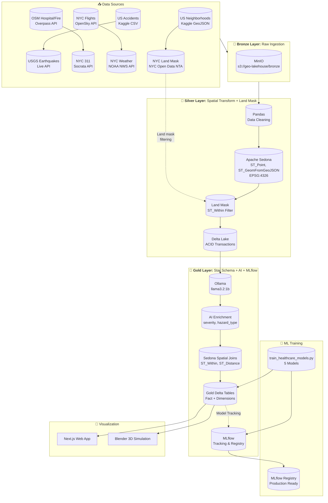
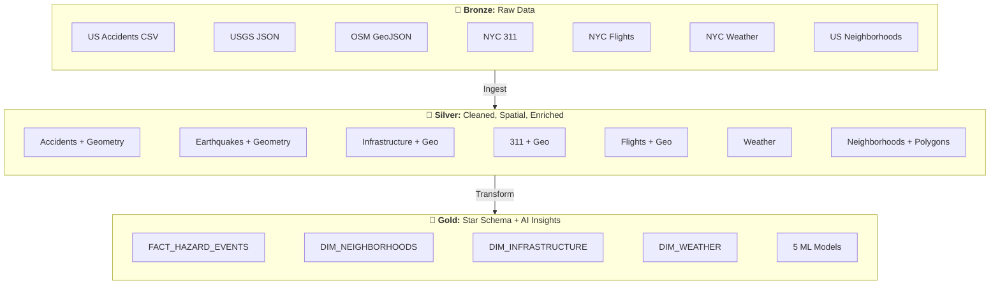
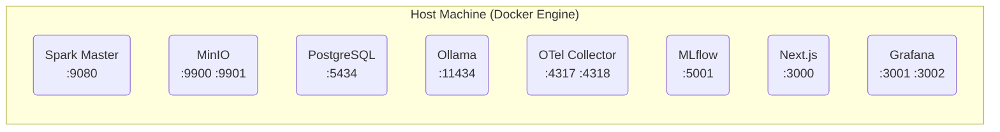
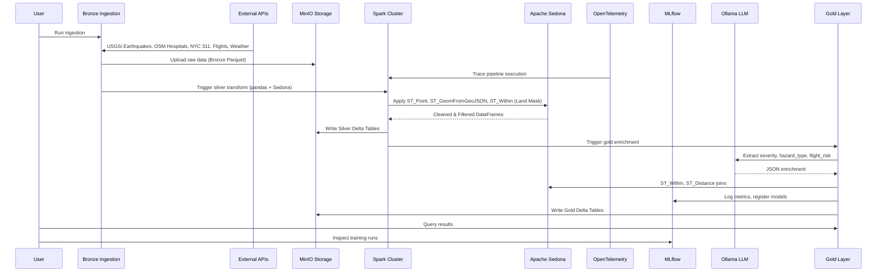
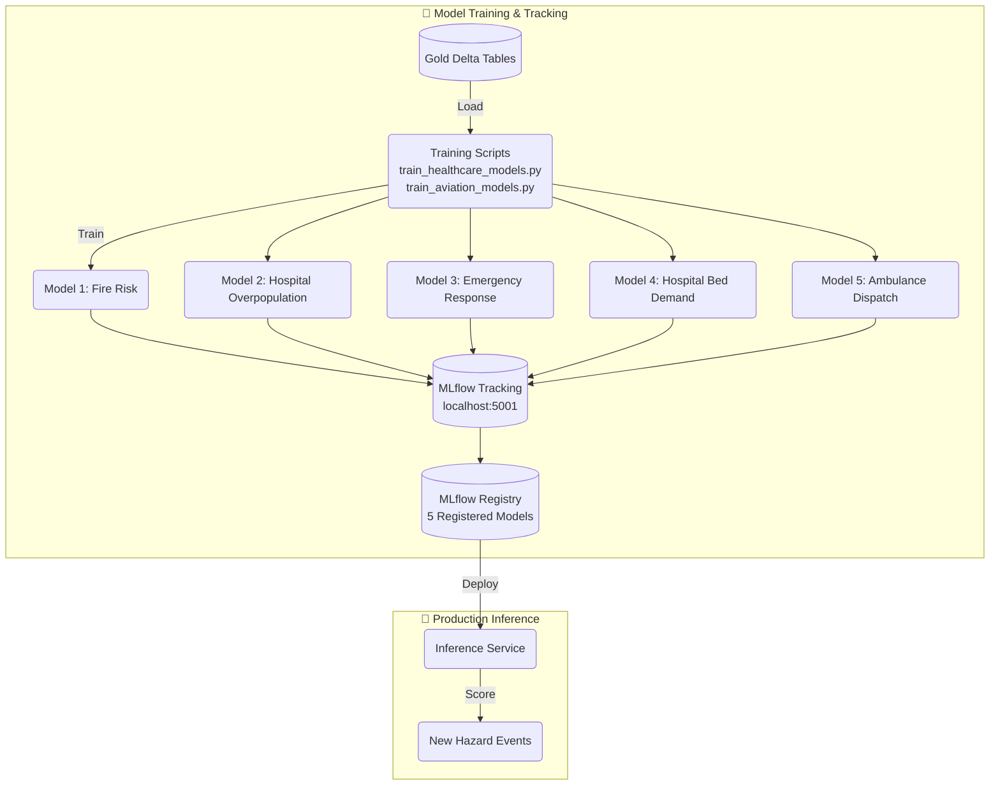
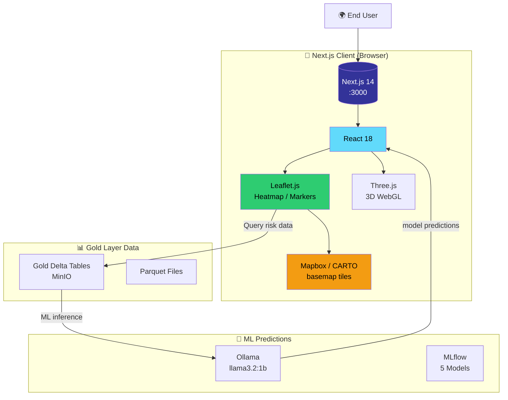
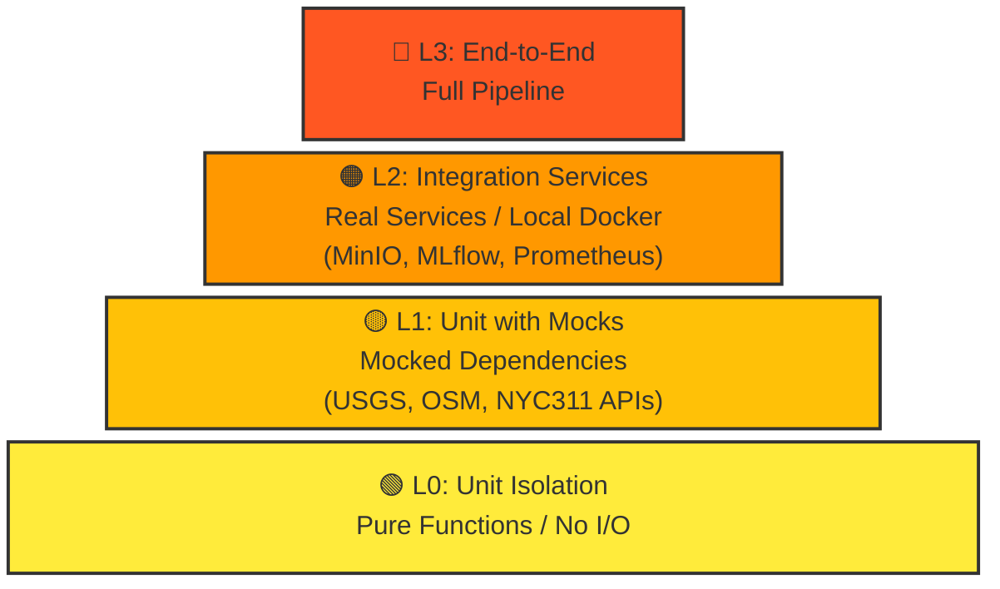

# GeoAI Medallion Architecture Pipeline

<p align="center">
  
  
  
  
  
  
  
  
</p>

A production-ready **Local Databricks Clone** for GeoAI portfolio projects using Medallion Architecture with Apache Spark, Apache Sedona, Delta Lake, MinIO, OpenTelemetry, MLflow, Blender 3D visualization, and local LLM integration.

---

## Table of Contents

1. [Architecture Overview](#architecture-overview)
2. [Tech Stack](#tech-stack)
3. [Infrastructure](#infrastructure)
4. [Data & Model Flow](#data-and-model-flow)
5. [Web App Architecture](#web-app-architecture)
6. [Getting Started](#getting-started)
7. [Pipeline Components](#pipeline-components)
8. [Testing Pyramid](#testing-pyramid)
9. [Blender 3D Integration](#blender-3d-integration)
10. [Deployment](#deployment)
11. [Troubleshooting](#troubleshooting)
12. [API References](#api-references)

---

## Architecture Overview

### High-Level System Architecture



### Medallion Layers



---

## Infrastructure

### Docker Containers Architecture

The pipeline runs entirely in Docker containers orchestrated via `docker-compose.yml`:



### Service Details

| Service | Port | Image | Purpose |
|---------|------|-------|---------|
| **Spark Master** | 9080 | bitnami/spark:3.5 | Distributed compute engine |
| **MinIO** | 9900/9901 | minio/minio | S3-compatible object storage |
| **PostgreSQL** | 5434 | postgres:15 | Hive metastore + MLflow backend |
| **Ollama** | 11434 | ollama/ollama | Local LLM inference |
| **OTel Collector** | 4317/4318 | otel/opentelemetry-collector | Metrics & traces |
| **MLflow** | 5001 | mlflow/mlflow | Experiment tracking |
| **Next.js** | 3000 | node:20-alpine | Web app frontend |
| **Grafana** | 3001/3002 | grafana/grafana | Dashboards & visualization |

### Quick Start

```bash
# Start all infrastructure
docker compose up -d

# Verify services
docker compose ps

# View logs
docker compose logs -f spark
docker compose logs -f minio

# Check health
curl -s http://localhost:9900/minio/health/live
curl -s http://localhost:5001/health
curl -s http://localhost:3001/api/health
```

### Individual Service Access

```bash
# MinIO Console (admin / minio123)
http://localhost:9900

# MLflow
http://localhost:5001

# Grafana (admin / admin)
http://localhost:3001

# Next.js Web App
http://localhost:3000
```

### Environment Variables

```bash
# .env.example
MINIO_ROOT_USER=admin
MINIO_ROOT_PASSWORD=minio123
POSTGRES_PASSWORD=postgres
MLFLOW_TRACKING_URI=http://localhost:5001
SPARK_MASTER=spark://localhost:7077
OLLAMA_BASE_URL=http://localhost:11434
```

### Stopping and Cleanup

```bash
# Stop services
docker compose down

# Stop and remove volumes
docker compose down -v

# Remove all containers, volumes, and images
docker compose down --rmi all -v
```

### Troubleshooting

```bash
# Check container status
docker compose ps -a

# Restart a specific service
docker compose restart spark

# View service logs
docker compose logs --tail=100 spark

# Shell into a container
docker compose exec spark bash
docker compose exec minio sh
```

### Data Persistence

Data persists in Docker volumes:

- `postgres_data` - PostgreSQL database
- `minio_data` - MinIO storage
- `mlflow_artifacts` - MLflow model artifacts

---

## Data and Model Flow

### Pipeline Execution Flow



### MLflow Model Training Flow



---

## Web App Architecture

### Maps + React + Next.js Stack



### Features

- **Interactive Heatmap**: Leaflet.js with CARTO tiles
- **5 ML Model Predictions**: Fire Risk, Hospital Overpopulation, Emergency Response, Bed Demand, Ambulance Dispatch
- **Real-time filtering**: Filter by hazard type
- **3D Visualization**: Three.js for WebGL rendering
- **Next.js 14 App Router**: Modern React full-stack

### Running the Web App

```bash
# Development
cd web && npm run dev

# Production build
cd web && npm run build
npm start

# Access
# http://localhost:3000
```

---

## Tech Stack

| Component | Technology | Version | Purpose |
|-----------|------------|---------|---------|
| **Compute Engine** | Apache Spark (PySpark) | 3.5.0 | Distributed processing |
| **Spatial Engine** | Apache Sedona | 1.5.0 | Geospatial SQL on Spark |
| **Storage** | Delta Lake | 3.1.0 | ACID on data lake |
| **Object Storage** | MinIO | Latest | S3-compatible storage |
| **Observability** | OpenTelemetry | Latest | Metrics & Trace collection |
| **Database** | PostgreSQL | 15 | Hive Metastore + MLflow DB |
| **MLOps** | MLflow | 2.10.0 | Experiment tracking |
| **LLM** | Ollama | Latest | Local LLM inference |
| **Viz** | Blender | Latest | 3D Simulation Rendering |
| **Maps** | Leaflet + Mapbox | Latest | Web mapping |
| **Frontend** | React + Next.js | 14 | Web app |
| **3D Engine** | Three.js | Latest | WebGL rendering |

---

## Getting Started

### Prerequisites

```bash
# Core requirements
Docker >= 20.10
Docker Compose >= 2.0
Python >= 3.9
8GB RAM (16GB recommended)
```

### Quick Start

```bash
# 1. Clone and navigate
cd geo-ai-medallion-architecture-pipeline

# 2. Copy environment template
cp .env.example .env

# 3. Start infrastructure
docker compose up -d

# 4. Verify services
./scripts/run_pipeline.sh status

# 5. Run ingestion (Bronze) - all 8 data sources
python src/bronze_ingestion.py

# 6. Run Silver transforms (pandas + Sedona)
spark-submit src/silver_pandas_transform.py
spark-submit src/silver_sedona_transform.py

# 7. Run Gold enrichment
spark-submit src/gold_dimensional_modeling.py

# 8. Train ML models
python src/train_healthcare_models.py
python src/train_aviation_models.py

# 9. Run full pipeline
python src/run_pipeline.py
```

---

## Pipeline Components

### 1. Bronze Layer (Raw Data Ingestion)

**File:** `src/bronze_ingestion.py`

Ingests raw data from 8 external sources into MinIO Bronze layer:

| Source | API | Format |
|--------|-----|-------|
| US Accidents | Kaggle CSV | CSV |
| USGS Earthquakes | USGS FDSN API | JSON (GeoJSON) |
| OSM Infrastructure | Overpass API | XML → JSON |
| NYC 311 | Socrata API | JSON |
| NYC Flights | OpenSky Network API | JSON |
| NYC Weather | NOAA NWS API | JSON |
| US Neighborhoods | Kaggle GeoJSON | GeoJSON |
| NYC Land Mask | NYC Open Data NTA | GeoJSON |

**Execution:**
```bash
python src/bronze_ingestion.py
```

### 2. Silver Layer (Cleaned + Spatial Transform)

Two-step transformation:

#### Step 1: Pandas Cleaning
**File:** `src/silver_pandas_transform.py`

Cleans, deduplicates, handles missing values.

```bash
spark-submit src/silver_pandas_transform.py
```

#### Step 2: Sedona Spatial
**File:** `src/silver_sedona_transform.py`

Applies spatial operations:
- `ST_Point()` - Creates geometries from lat/lon
- `ST_GeomFromGeoJSON()` - Parses GeoJSON
- `ST_Within()` - Land mask filtering (NYCNTA boundary)
- `ST_Distance()` - Proximity calculations
- `ST_Buffer()` - Service area buffers

```bash
spark-submit src/silver_sedona_transform.py
```

### 3. Gold Layer (Star Schema + AI Enrichment)

**File:** `src/gold_dimensional_modeling.py`

Creates dimensional star schema:

| Table | Type | Description |
|-------|------|------------|
| `fact_hazard_events` | Fact | Combined hazard events with AI-enriched labels |
| `dim_neighborhoods` | Dimension | NYC neighborhoods with risk scores |
| `dim_infrastructure` | Dimension | Hospitals, fire stations, EMS |
| `dim_weather` | Dimension | Weather conditions |

AI Enrichment via Ollama:
- `severity`: Critical, High, Medium, Low
- `hazard_type`: Fire, Medical, Weather, Infrastructure
- `flight_risk`: High, Medium, Low

```bash
spark-submit src/gold_dimensional_modeling.py
```

### 4. ML Training

#### Healthcare Models
**File:** `src/train_healthcare_models.py`

Trains 5 supervised models:

| Model | Task | Algorithm | Target |
|-------|------|----------|--------|
| NYC Fire Risk Model | Classification | Fire probability |
| Hospital Overpopulation | Classification | Overcapacity |
| Emergency Response | Regression | Response time |
| Hospital Bed Demand | Regression | Bed shortage |
| Ambulance Dispatch | Classification | Dispatch optimization |

```bash
python src/train_healthcare_models.py
```

#### Aviation Models
**File:** `src/train_aviation_models.py`

Flight delay prediction models.

```bash
python src/train_aviation_models.py
```

### 5. Full Pipeline Orchestration

**File:** `src/run_pipeline.py`

Runs complete Bronze → Silver → Gold pipeline:

```bash
python src/run_pipeline.py
```

---

## Testing Pyramid



### Test Results

```bash
# Run all tests
pytest

# Run L0 unit tests only
pytest tests/test_l0_*.py

# Run L1 integration tests
pytest tests/test_l1_*.py

# Run L2 component tests
pytest tests/test_l2_*.py

# Run L3 E2E tests
pytest tests/test_l3_*.py

# Result: 102 passed, 14 warnings
# No skipped tests - per Constitution rule
```

---

## Blender 3D Integration

**File:** `scripts/render_flight_simulation.py`

Automates 3D data visualization from Gold layer Parquet files. Uses Python API within Blender to procedurally generate NYC flight simulation environments.

```bash
# Generate 3D simulation
blender -b examples/nyc_ml_heatmap.blend -P scripts/render_flight_simulation.py
```

**Features:**
- Procedural building generation from NYC GeoJSON
- Flight path visualization
- Heatmap coloring by ML risk scores
- Real-time camera animation

---

## Heatmap Visualization

**File:** `scripts/quick_heatmap.py`

Reads gold layer parquet files and generates a Leaflet heatmap.

```bash
python scripts/quick_heatmap.py
```

Output: `public/data/heatmap.geojson`

---

## Deployment

### Docker Production Build

```bash
# Build all images
docker compose build

# Scale Spark workers
docker compose up -d --scale spark-worker=3

# Enable MLflow registry
docker compose up -d mlflow-server
```

### K8s (Future)

```bash
# Deploy to Kubernetes
kubectl apply -f k8s/
```

---

## Troubleshooting

| Issue | Solution |
|-------|----------|
| Spark not connecting to MinIO | Check MinIO endpoint in config |
| Ollama API timeout | Increase `OLLAMA_TIMEOUT` |
| Sedona functions not found | Ensure Sedona plugin registered |
| Missing telemetry data | Ensure OpenTelemetry collector is running |
| MLflow not tracking | Check `MLFLOW_TRACKING_URI` |
| OSM API 406 error | Add `User-Agent: curl/8.7.1` header |
| Java 25 incompatible | Use `openjdk@17` for Spark |

### Service Health Checks

```bash
# MinIO
curl -s http://localhost:9900/minio/health/live

# MLflow
curl -s http://localhost:5001/health

# Grafana
curl -s http://localhost:3001/api/health

# PostgreSQL
docker compose exec postgres pg_isready -U postgres

# Spark
curl -s http://localhost:9080
```

---

## API References

### External APIs

| API | Endpoint | Documentation |
|-----|---------|-------------|
| USGS | https://earthquake.usgs.gov/fdsnws/event/1/query | USGS Docs |
| OSM Overpass | https://overpass-api.de/api/interpreter | OSM Docs |
| NYC 311 | https://data.cityofnewyork.us/resource/fhrw-4uyv.json | NYC Open Data |
| NYC Flights | https://opensky-network.org/api/states/all | OpenSky API |
| NOAA Weather | https://api.weather.gov | NWS API |

### Internal APIs

| Service | Endpoint |
|--------|----------|
| Spark Master | spark://localhost:7077 |
| Spark UI | http://localhost:9090 |
| MinIO Console | http://localhost:9900 |
| MLflow | http://localhost:5001 |
| Grafana | http://localhost:3001 |
| Next.js | http://localhost:3000 |

---

## Credits

- [Apache Sedona](https://sedona.apache.org/) - Geospatial SQL on Spark
- [Delta Lake](https://delta.io/) - ACID transactions on data lakes
- [Ollama](https://ollama.ai/) - Local LLM inference
- [OpenTelemetry](https://opentelemetry.io/) - Observability framework
- [MLflow](https://mlflow.org/) - MLOps platform
- [Blender](https://www.blender.org/) - 3D Content Creation
- [USGS](https://earthquake.usgs.gov/) - Earthquake data
- [OpenStreetMap](https://www.openstreetmap.org/) - Infrastructure data
- [NYC Open Data](https://data.cityofnewyork.us/) - NYC municipal data
- [OpenSky Network](https://opensky-network.org/) - Aviation data
- [NOAA NWS](https://www.weather.gov/) - Weather data

---

<p align="center">
  Built with ❤️ for GeoAI Portfolio Projects
</p>