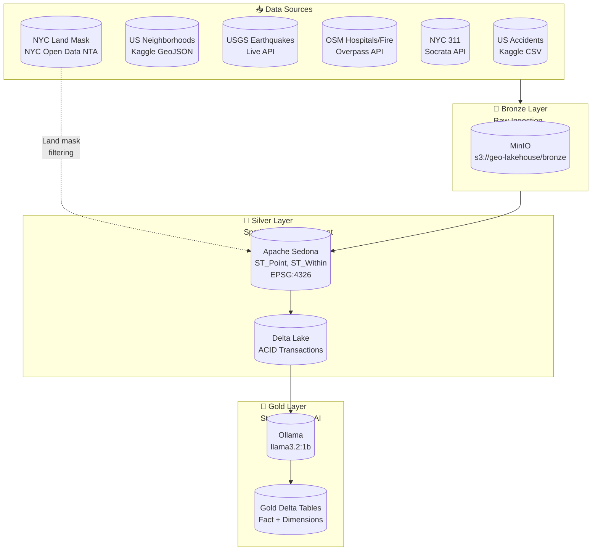

# GeoAI Medallion Architecture Pipeline

<p align="center">
  
  
  
  
  
</p>

A production-ready **Local Databricks Clone** for GeoAI portfolio projects using Medallion Architecture with Apache Spark, Apache Sedona, Delta Lake, MinIO, and local LLM integration.

---

## Table of Contents

1. [Architecture](#architecture)
2. [Data Sources](#data-sources)
3. [Getting Started](#getting-started)
4. [Pipeline Components](#pipeline-components)
5. [Heatmap Visualization](#heatmap-visualization)
6. [Testing](#testing)
7. [Deployment](#deployment)
8. [Troubleshooting](#troubleshooting)

---

## Architecture

### System Architecture



### Medallion Layers

```mermaid
flowchart LR
    subgraph BRONZE["🥉 Bronze<br/>Raw Data"]
        B1[US Accidents CSV]
        B2[USGS JSON]
        B3[OSM GeoJSON]
    end

    subgraph SILVER["🥈 Silver<br/>Cleaned, Spatial, Enriched"]
        S1[Accidents + Geometry]
        S2[Earthquakes + Geometry]
        S3[Neighborhoods + Polygons]
    end

    subgraph GOLD["🥇 Gold<br/>Star Schema + AI Insights"]
        G1[FACT_HAZARD_EVENTS]
        G2[DIM_NEIGHBORHOODS]
        G3[DIM_INFRASTRUCTURE]
    end

    BRONZE -->|"Ingest"| SILVER
    SILVER -->|"Transform"| GOLD
```



---

## Data Sources

| Source | Type | Endpoint | Purpose |
|--------|------|----------|---------|
| **US Accidents** | CSV | Kaggle (`US_Accidents_2019-2023.csv`) | Primary hazard events |
| **US Neighborhoods** | GeoJSON | Kaggle (`us_neighborhoods.csv`) | Neighborhood boundaries for spatial joins |
| **USGS Earthquakes** | JSON | `earthquake.usgs.gov/fdsnws/event/1/query` | Live earthquake feed |
| **OSM Infrastructure** | GeoJSON | Overpass API (`/api/interpreter`) | Hospitals & fire stations |
| **NYC 311 Requests** | JSON | Socrata API (`data.cityofnewyork.us`) | Service request incidents |
| **NYC Land Mask** | GeoJSON | NYC Open Data NTA (`services5.arcgis.com`) | 195 neighborhood polygons for filtering water dots |

> **NYC Land Mask (`nyc_landmask.json`):** Used by `scripts/quick_heatmap.py` to filter ML prediction points, preventing dots from appearing over water (East River, harbor, ocean). Source: [NYC Open Data Neighborhood Tabulation Areas (2010)](https://data.cityofnewyork.us/City-Government/NTA-2010/fxpq-c8ku) — 195 features.

---

## Getting Started

### Prerequisites

```bash
Docker >= 20.10
Docker Compose >= 2.0
Python >= 3.9
8GB RAM (16GB recommended)
```

### Quick Start

```bash
# 1. Clone and navigate
cd geo-ai-medallion-architecture-pipeline

# 2. Copy environment template
cp .env.example .env

# 3. Start infrastructure
docker compose up -d

# 4. Run full pipeline (Bronze → Silver → Gold)
python src/run_pipeline.py

# 5. Generate heatmap for web visualization
python scripts/quick_heatmap.py

# 6. Start heatmap web app
cd geo-ai-heatmap && npm install && npm run dev
# Open http://localhost:3000
```

### Service Ports

| Service | Port | URL |
|---------|------|-----|
| Spark UI | 9080 | http://localhost:9080 |
| MinIO Console | 9901 | http://localhost:9901 |
| PostgreSQL | 5434 | localhost:5434 |
| Ollama | 11434 | http://localhost:11434 |
| Heatmap Web | 3000 | http://localhost:3000 |

### Environment Variables

```bash
# Required
export MINIO_ROOT_USER=minioadmin
export MINIO_ROOT_PASSWORD=minioadmin123
export POSTGRES_DB=geometastore
export POSTGRES_USER=geoai
export POSTGRES_PASSWORD=geoi_secure_pass_2024

# LLM (Ollama)
export OLLAMA_BASE_URL=http://geoai-ollama:11434
export OLLAMA_MODEL=llama3.2:1b

# Optional (for Kaggle data)
export KAGGLE_USERNAME=your_username
export KAGGLE_API_KEY=your_api_key
```

---

## Pipeline Components

### 1. Bronze Layer (Ingestion)

**File:** `src/bronze_ingestion.py`

Ingests raw data from all sources into MinIO bronze storage.

```python
def fetch_usgs_earthquakes(config, days_back=30, min_magnitude=2.0):
    """Fetch from USGS FDSN Web Services API"""

def fetch_osm_infrastructure(config, bbox=(-125, 24, -66, 50)):
    """Fetch hospitals/fire stations via Overpass API"""

def fetch_nyc_311_requests(config, limit=100000):
    """Fetch 311 service requests from Socrata"""
```

**Output:** Raw JSON/CSV in `s3://geo-lakehouse/bronze/`

---

### 2. Silver Layer (Spatial + LLM Enrichment)

**File:** `src/silver_enrichment.py`

Applies geometry creation, land mask filtering, and LLM-based hazard type classification.

```python
def create_geometry_from_latlon(df, lat_col, lon_col):
    """ST_Point - Convert lat/lng to geometry"""
    return df.withColumn(
        "geometry",
        F.expr("ST_Point(cast(lon as double), cast(lat as double))")
    )

def apply_land_mask_filter(df, land_mask_gdf):
    """Filter points outside land area using ST_Within + US bounds fallback"""
```

**Land Mask Filtering:** Three-layer strategy:
1. **ST_Within** — Sedona spatial join against neighborhood polygons
2. **Numeric BBox** — ST_XMin/Max bounds on geometry column
3. **US Range Fallback** — lon ∈ [-125, -66], lat ∈ [24, 50]

**Output:** Delta Tables in `s3://geo-lakehouse/silver/`

---

### 3. Gold Layer (Dimensional Modeling)

**File:** `src/gold_dimensional_modeling.py`

Builds Kimball star schema — fact and dimension tables — from silver layer.

```python
def build_fact_hazard_events(silver_df, dim_neighborhoods):
    """Fact table: hazard events with neighborhood FK"""

def build_dim_neighborhoods(neighborhoods_df):
    """Dimension table: neighborhood attributes"""
```

**Output:** Star schema in `s3://geo-lakehouse/gold/`

---

## Heatmap Visualization

**File:** `scripts/quick_heatmap.py`

Reads gold layer parquet files and generates a Leaflet heatmap as a GeoJSON file.

```python
def generate_heatmap(output_path="geo-ai-heatmap/public/data/heatmap.geojson"):
    land_mask = get_land_mask()      # NYC Open Data NTA (195 features)
    predictions_df = pd.read_parquet(...)
    hazards_df = pd.read_parquet(...)

    # Spatial join with land mask to remove water dots
    filtered = gpd.sjoin(gdf, land_mask, how="inner", predicate='intersects')
```

**Web app:** `geo-ai-heatmap/` — Next.js + Leaflet heatmap.

```bash
cd geo-ai-heatmap && npm install && npm run dev
```

Output: `geo-ai-heatmap/public/data/heatmap.geojson` (547 points, ~537 on land after filtering)

---

## Testing

```bash
# All tests
python -m pytest tests/ -v

# By level
python -m pytest tests/L0.py -v  # Unit isolation
python -m pytest tests/L1.py -v  # Component integration
python -m pytest tests/L2.py -v  # Pipeline stages
python -m pytest tests/L3.py -v  # E2E
```

---

## Deployment

```yaml
services:
  spark:
    image: jupyter/pyspark-notebook:spark-3.5.0
    ports:
      - "9077:7077"
      - "9080:8080"

  minio:
    image: minio/minio:latest
    ports:
      - "9900:9000"
      - "9901:9001"

  postgres:
    image: postgres:15-alpine
    ports:
      - "5434:5432"

  ollama:
    image: ollama/ollama:latest
    ports:
      - "11434:11434"
```

---

## Troubleshooting

| Issue | Solution |
|-------|----------|
| Spark cannot connect to MinIO | Check `MINIO_ENDPOINT` and bucket names in config |
| Ollama API timeout | Increase `OLLAMA_TIMEOUT` in config |
| Sedona ST_* functions not found | Ensure `SedonaContext.create(spark)` is called to register the plugin |
| Null geometries after transform | Verify lat/lon column names match expected (`latitude`/`Start_Lat` etc.) |
| Heatmap shows dots in water | Re-run `python scripts/quick_heatmap.py` to regenerate with land mask filter |
| Points missing near shoreline | Land mask uses `intersects` predicate (lenient) — points touching land boundaries are kept |

### Debug Commands

```bash
# Check Spark logs
docker compose logs spark

# Test MinIO connectivity
docker exec geoai-spark python -c "import boto3; print('OK')"

# Verify Delta tables
spark.read.format("delta").load("s3://bucket/table").printSchema()
```

---

## Credits

- [Apache Sedona](https://sedona.apache.org/) — Geospatial SQL on Spark
- [Delta Lake](https://delta.io/) — ACID transactions on data lakes
- [Ollama](https://ollama.ai/) — Local LLM inference
- [NYC Open Data](https://data.cityofnewyork.us/) — Neighborhood Tabulation Areas

---

<p align="center">
  Built with ❤️ for GeoAI Portfolio Projects
</p>