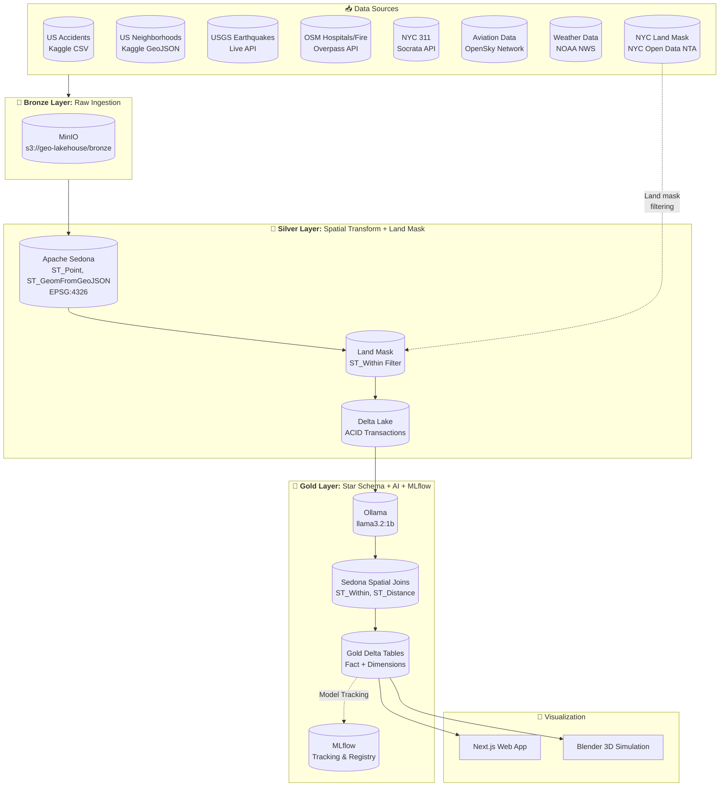
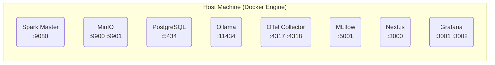
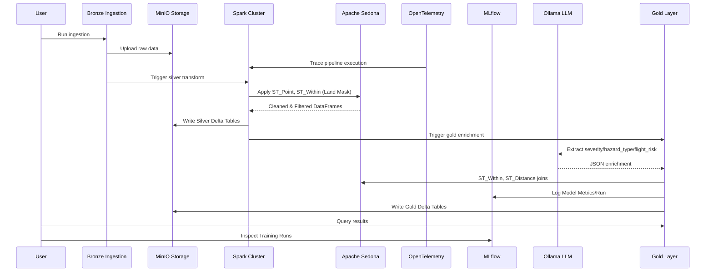
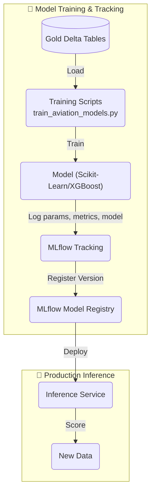
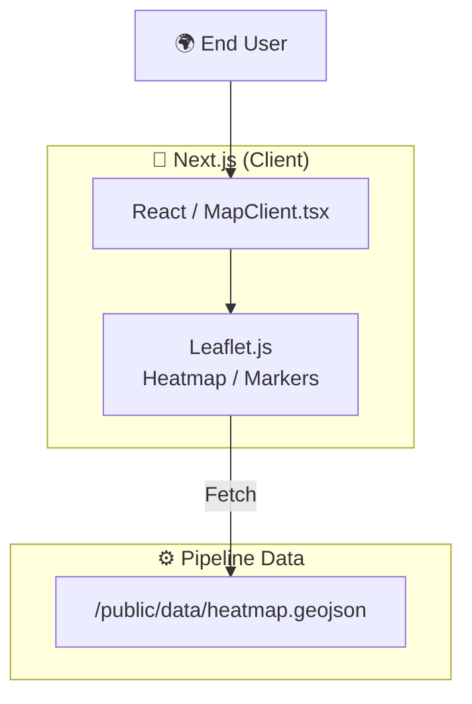
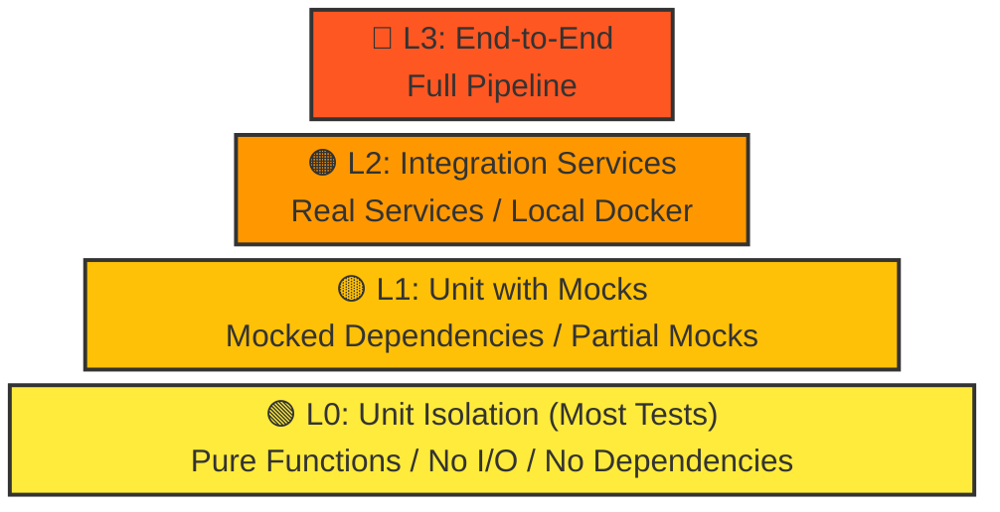

# GeoAI Medallion Architecture Pipeline

<p align="center">
  
  
  
  
  
  
  
  
</p>

A production-ready **Local Databricks Clone** for GeoAI portfolio projects using Medallion Architecture with Apache Spark, Apache Sedona, Delta Lake, MinIO, OpenTelemetry, MLflow, Blender 3D visualization, and local LLM integration.

---

## Table of Contents

1. [Architecture Overview](#architecture-overview)
2. [Tech Stack](#tech-stack)
3. [Infrastructure](#infrastructure)
4. [Data & Model Flow](#data-and-model-flow)
5. [Web App Architecture](#web-app-architecture)
6. [Getting Started](#getting-started)
6. [Pipeline Components](#pipeline-components)
7. [Testing Pyramid](#testing-pyramid)
8. [Blender 3D Integration](#blender-3d-integration)
9. [Deployment](#deployment)
10. [Troubleshooting](#troubleshooting)
11. [API References](#api-references)

---

## Architecture Overview

### High-Level System Architecture



---

## Infrastructure

### Docker Containers Architecture

The pipeline runs entirely in Docker containers orchestrated via `docker-compose.yml`:



### Service Details

| Service | Port | Image | Purpose |
|---------|------|-------|---------|
| **Spark Master** | 9080 | bitnami/spark:3.5 | Distributed compute engine |
| **MinIO** | 9900/9901 | minio/minio | S3-compatible object storage |
| **PostgreSQL** | 5434 | postgres:15 | Hive metastore + MLflow backend |
| **Ollama** | 11434 | ollama/ollama | Local LLM inference |
| **OTel Collector** | 4317/4318 | otel/opentelemetry-collector | Metrics & traces |
| **MLflow** | 5001 | mlflow/mlflow | Experiment tracking |
| **Next.js** | 3000 | node:20-alpine | Web app frontend |
| **Grafana** | 3001/3002 | grafana/grafana | Dashboards & visualization |

### Quick Start

```bash
# Start all infrastructure
docker compose up -d

# Verify services
docker compose ps

# View logs
docker compose logs -f spark
docker compose logs -f minio

# Check health
curl -s http://localhost:9900/minio/health/live
curl -s http://localhost:5001/api/2.0/preview/mlflow/genesys
curl -s http://localhost:3001/api/health
```

### Individual Service Access

```bash
# MinIO Console (admin / minio123)
http://localhost:9900

# MLflow
http://localhost:5001

# Grafana (admin / admin)
http://localhost:3001

# Next.js Web App
http://localhost:3000
```

### Environment Variables

```bash
# .env.example
MINIO_ROOT_USER=admin
MINIO_ROOT_PASSWORD=minio123
POSTGRES_PASSWORD=postgres
MLFLOW_TRACKING_URI=http://localhost:5001
SPARK_MASTER=spark://localhost:7077
OLLAMA_BASE_URL=http://localhost:11434
```

### Stopping and Cleanup

```bash
# Stop services
docker compose down

# Stop and remove volumes
docker compose down -v

# Remove all containers, volumes, and images
docker compose down --rmi all -v
```

### Troubleshooting

```bash
# Check container status
docker compose ps -a

# Restart a specific service
docker compose restart spark

# View service logs
docker compose logs --tail=100 spark

# Shell into a container
docker compose exec spark bash
docker compose exec minio sh
```

### Data Persistence

Data persists in Docker volumes:

- `postgres_data` - PostgreSQL database
- `minio_data` - MinIO storage
- `mlflow_artifacts` - MLflow model artifacts

---

## Data and Model Flow

### Pipeline Execution Flow



### MLflow Model Training Flow



---

## Web App Architecture



---

## Tech Stack

| Component | Technology | Version | Purpose |
|-----------|------------|---------|---------|
| **Compute Engine** | Apache Spark (PySpark) | 3.5.0 | Distributed processing |
| **Spatial Engine** | Apache Sedona | 1.5.0 | Geospatial SQL on Spark |
| **Storage** | Delta Lake | 3.1.0 | ACID on data lake |
| **Object Storage** | MinIO | Latest | S3-compatible storage |
| **Observability** | OpenTelemetry | Latest | Metrics & Trace collection |
| **Database** | PostgreSQL | 15 | Hive Metastore + MLflow DB |
| **MLOps** | MLflow | 2.10.0 | Experiment tracking |
| **LLM** | Ollama | Latest | Local LLM inference |
| **Viz** | Blender | Latest | 3D Simulation Rendering |

---

## Getting Started

### Prerequisites

```bash
# Core requirements
Docker >= 20.10
Docker Compose >= 2.0
Python >= 3.9
8GB RAM (16GB recommended)
```

### Quick Start

```bash
# 1. Clone and navigate
cd geo-ai-medallion-architecture-pipeline

# 2. Copy environment template
cp .env.example .env

# 3. Start infrastructure
docker compose up -d

# 4. Verify services
./scripts/run_pipeline.sh status

# 5. Run ingestion (Bronze)
python src/bronze_ingestion.py

# 6. Run Silver transform
spark-submit src/silver_sedona_transform.py

# 7. Run Gold enrichment & Model training
spark-submit src/gold_schema_and_ai_enrichment.py
python src/train_aviation_models.py
```

---

## Pipeline Components

### 1. Bronze Layer (Ingestion)

**File:** `src/bronze_ingestion.py`

### 2. Silver Layer (Spatial Transform + Land Masking)

**File:** `src/silver_sedona_transform.py`

### 3. Gold Layer (AI + Spatial Joins + MLflow)

**File:** `src/gold_schema_and_ai_enrichment.py`

### 4. Training (MLflow)

**File:** `src/train_aviation_models.py`

---

## Testing Pyramid



---

## Blender 3D Integration

**File:** `scripts/render_flight_simulation.py`

Automates 3D data visualization from Gold layer Parquet files. Uses Python API within Blender to procedurally generate NYC flight simulation environments.

```bash
# Generate 3D simulation
blender -b examples/nyc_ml_heatmap.blend -P scripts/render_flight_simulation.py
```

---

## Heatmap Visualization

**File:** `scripts/quick_heatmap.py`

Reads gold layer parquet files and generates a Leaflet heatmap.

---

## Troubleshooting

| Issue | Solution |
|-------|----------|
| Spark not connecting to MinIO | Check MinIO endpoint in config |
| Ollama API timeout | Increase `OLLAMA_TIMEOUT` |
| Sedona functions not found | Ensure Sedona plugin registered |
| Missing telemetry data | Ensure OpenTelemetry collector is running |
| MLflow not tracking | Check `MLFLOW_TRACKING_URI` environment variable |

---

## Credits

- [Apache Sedona](https://sedona.apache.org/) - Geospatial SQL on Spark
- [Delta Lake](https://delta.io/) - ACID transactions on data lakes
- [Ollama](https://ollama.ai/) - Local LLM inference
- [OpenTelemetry](https://opentelemetry.io/) - Observability framework
- [MLflow](https://mlflow.org/) - MLOps platform
- [Blender](https://www.blender.org/) - 3D Content Creation

---

<p align="center">
  Built with ❤️ for GeoAI Portfolio Projects
</p>
