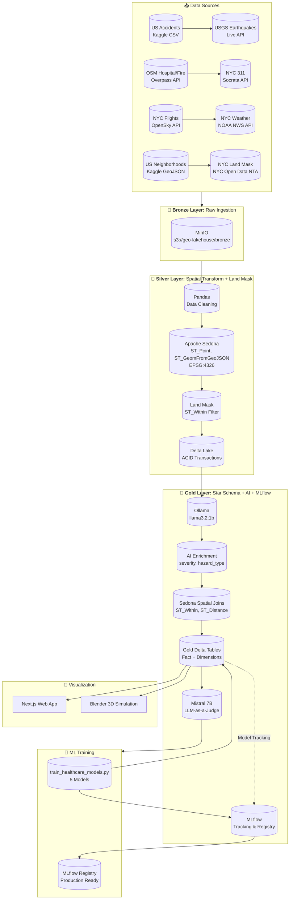
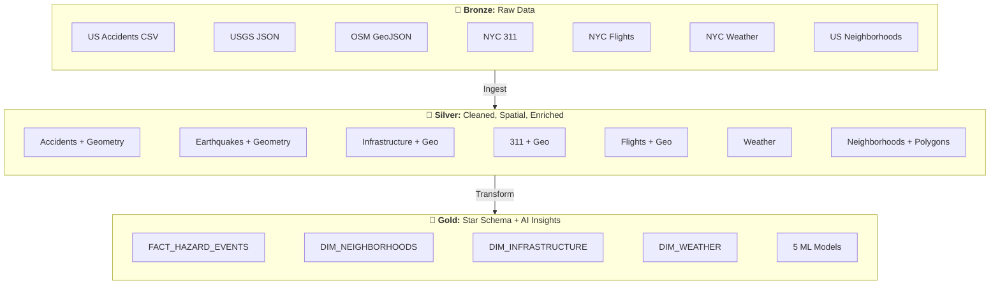
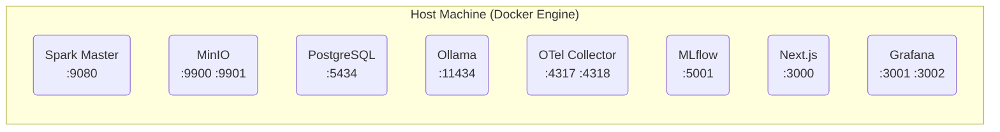
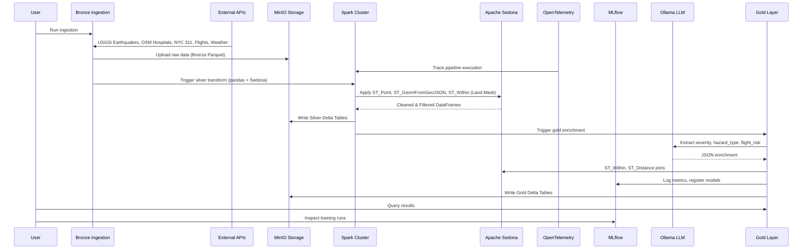
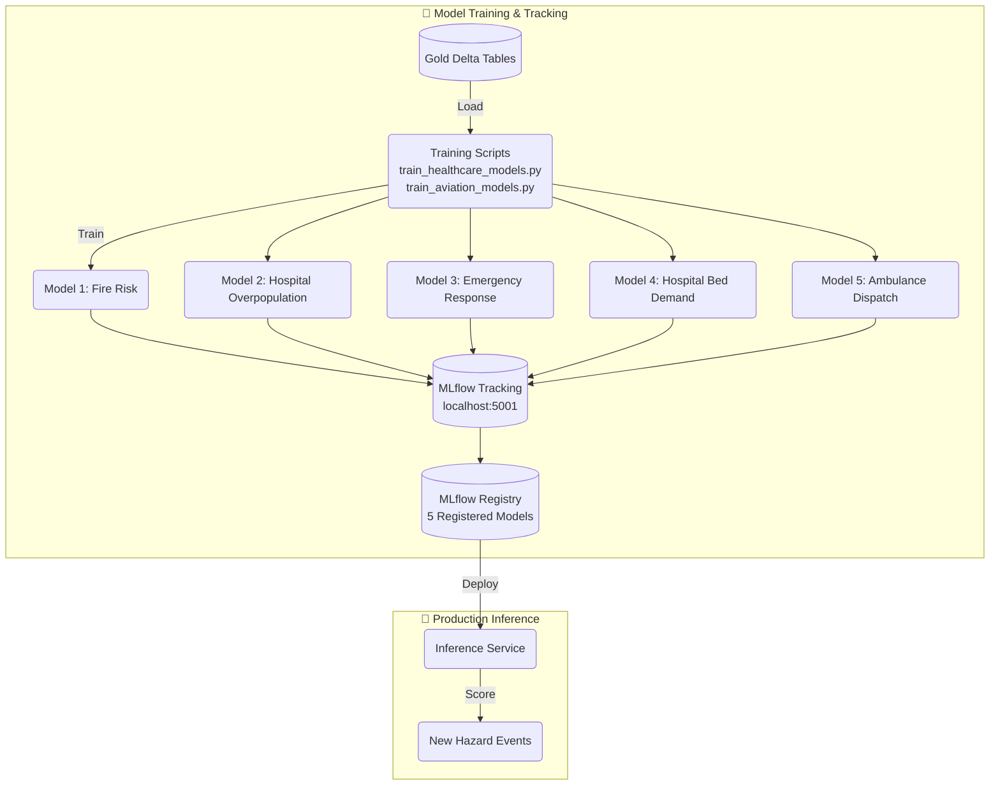
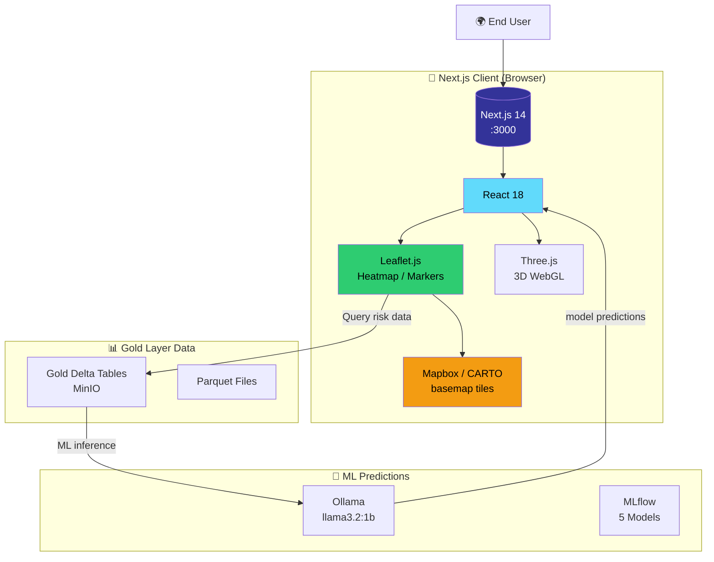
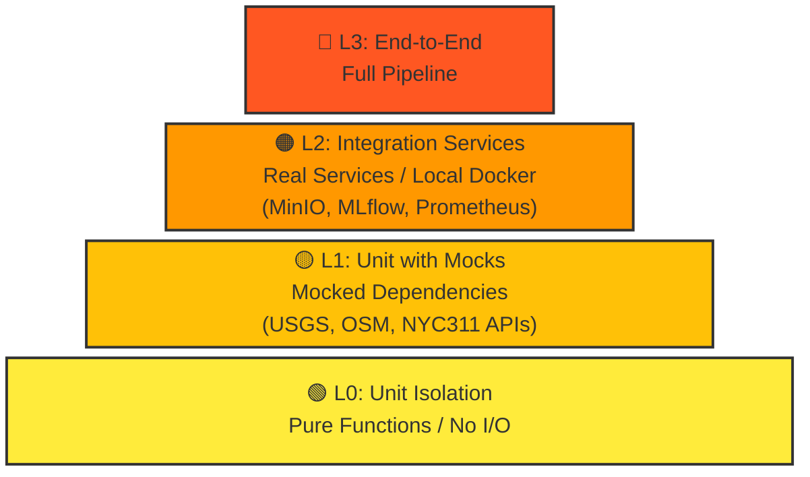

# GeoAI Medallion Architecture Pipeline

<p align="center">
  
  
  
  
  
  
  
  
  
  
</p>

A production-ready **Local Databricks Clone** for GeoAI portfolio projects using Medallion Architecture with Apache Spark, Apache Sedona, Delta Lake, MinIO, OpenTelemetry, MLflow, Blender 3D visualization, and local LLM integration.

---

## Table of Contents

1. [Architecture Overview](#architecture-overview)
2. [Tech Stack](#tech-stack)
3. [Infrastructure](#infrastructure)
4. [Data & Model Flow](#data-and-model-flow)
5. [Web App Architecture](#web-app-architecture)
6. [Getting Started](#getting-started)
7. [Pipeline Components](#pipeline-components)
8. [Testing Pyramid](#testing-pyramid)
9. [Blender 3D Integration](#blender-3d-integration)
10. [Deployment](#deployment)
11. [Troubleshooting](#troubleshooting)
12. [API References](#api-references)

---

## Architecture Overview

### High-Level System Architecture



### Medallion Layers



---

## Infrastructure

### Docker Containers Architecture

The pipeline runs entirely in Docker containers orchestrated via `docker-compose.yml`:



### Service Details

| Service | Port | Image | Credentials | Purpose |
|---------|------|-------|-------------|---------|
| **Grafana** | 3000 | grafana/grafana | admin/admin123 | Dashboards & visualization |
| **MinIO Console** | 9001 | minio/minio | minioadmin/minioadmin123 | S3 object storage |
| **MinIO API** | 9000 | minio/minio | minioadmin/minioadmin123 | S3 API |
| **PostgreSQL** | 5434 | postgres:15 | postgres/postgres | Hive metastore + MLflow |
| **Ollama** | 11434 | ollama/ollama | (no auth) | Local LLM inference |
| **MLflow** | 5001 | mlflow/mlflow | (no auth) | Experiment tracking |
| **Prometheus** | 9090 | prom/prometheus | (no auth) | Metrics |
| **Spark Master** | 7077 | bitnami/spark:3.5 | (no auth) | Distributed compute |
| **SonarQube** | 9005 | sonarqube:10.4 | (no auth) | Static Code Analysis |

### Quick Start

```bash
# Start all infrastructure
docker compose up -d

# Verify services
docker compose ps

# Run Static Analysis (after SonarQube is up)
docker compose run --rm sonar-scanner

# View logs
docker compose logs -f spark
docker compose logs -f minio

# Check health
curl -s http://localhost:9000/minio/health/live
curl -s http://localhost:5001/health
curl -s http://localhost:3000/api/health
curl -s http://localhost:9090/-/healthy
```

### Individual Service Access

```bash
# Grafana Dashboards (admin / admin123)
http://localhost:3000/d/geoai-data-quality/geoai-data-quality
http://localhost:3000/d/geoai-pipeline/geoai-pipeline-performance

# SonarQube (admin / admin)
http://localhost:9005

# MinIO Console (minioadmin / minioadmin123)
http://localhost:9001

# MLflow (no auth)
http://localhost:5001

# Prometheus (no auth)
http://localhost:9090
```

### Environment Variables

```bash
# .env.example
MINIO_ROOT_USER=admin
MINIO_ROOT_PASSWORD=minio123
POSTGRES_PASSWORD=postgres
MLFLOW_TRACKING_URI=http://localhost:5001
SPARK_MASTER=spark://localhost:7077
OLLAMA_BASE_URL=http://localhost:11434
```

### Stopping and Cleanup

```bash
# Stop services
docker compose down

# Stop and remove volumes
docker compose down -v

# Remove all containers, volumes, and images
docker compose down --rmi all -v
```

### Troubleshooting

```bash
# Check container status
docker compose ps -a

# Restart a specific service
docker compose restart spark

# View service logs
docker compose logs --tail=100 spark

# Shell into a container
docker compose exec spark bash
docker compose exec minio sh
```

### Data Persistence

Data persists in Docker volumes:

- `postgres_data` - PostgreSQL database
- `minio_data` - MinIO storage
- `mlflow_artifacts` - MLflow model artifacts

---

## Data and Model Flow

### Pipeline Execution Flow



### MLflow Model Training Flow



---

## Web App Architecture

### Maps + React + Next.js Stack



### Features

- **Interactive Map**: Leaflet.js 1.9 with CARTO basemap tiles
- **5 ML Model Predictions**: Fire Risk, Hospital Overpopulation, Emergency Response, Bed Demand, Ambulance Dispatch
- **Real-time filtering**: Filter by hazard type (Fire, Medical, Hazmat, Rescue)
- **3D WebGL**: Three.js for browser-based 3D rendering
- **Next.js 14 App Router**: Modern React full-stack with SSR
- **React 18**: Concurrent mode, automatic batching
- **Hot Module Reloading**: Development with live reload

### Tech Stack Details

```
Frontend Stack:
├── Next.js 14 (App Router with SSR)
├── React 18 (Hooks + Concurrent Mode)
├── State Management
├── Leaflet.js 1.9 (Interactive Maps)
├── CARTO Basemap Tiles
└── Three.js (WebGL 3D Rendering)
```

### Running the Web App

```bash
# Development - requires separate web/ directory
cd web && npm run dev

# Production build
cd web && npm run build
npm start
```

---

## Tech Stack

| Component | Technology | Version | Purpose |
|-----------|------------|---------|---------|
| **Compute Engine** | Apache Spark (PySpark) | 3.5.0 | Distributed processing |
| **Spatial Engine** | Apache Sedona | 1.5.0 | Geospatial SQL on Spark |
| **Storage** | Delta Lake | 3.1.0 | ACID on data lake |
| **Object Storage** | MinIO | Latest | S3-compatible storage |
| **Observability** | OpenTelemetry | Latest | Metrics & Trace collection |
| **Database** | PostgreSQL | 15 | Hive Metastore + MLflow DB |
| **MLOps** | MLflow | 2.10.0 | Experiment tracking |
| **LLM** | Ollama | Latest | Local LLM inference |
| **LLM Judge** | Ollama + Mistral 7B | Latest | LLM-as-a-Judge quality audit |
| **Viz** | Blender | Latest | 3D Simulation Rendering |
| **Maps** | Leaflet.js 1.9 + CARTO | Latest | Web mapping |
| **Frontend** | React 18 + Next.js | 14 | Web app |
| **3D Engine** | Three.js | Latest | WebGL rendering |

---

## Getting Started

### Prerequisites

```bash
# Core requirements
Docker >= 20.10
Docker Compose >= 2.0
Python >= 3.9
8GB RAM (16GB recommended)
```

### Quick Start

```bash
# 1. Clone and navigate
cd geo-ai-medallion-architecture-pipeline

# 2. Copy environment template
cp .env.example .env

# 3. Start infrastructure
docker compose up -d

# 4. Verify services
./scripts/run_pipeline.sh status

# 5. Run ingestion (Bronze) - all 8 data sources
python src/bronze_ingestion.py

# 6. Run Silver transforms (Pandas + Sedona)
spark-submit src/silver_pandas_transform.py
spark-submit src/silver_sedona_transform.py

# 7. Run LLM-as-a-Judge quality audit
spark-submit src/silver_quality_audit.py

# 8. Run Gold enrichment
spark-submit src/gold_dimensional_modeling.py

# 8. Train ML models
python src/train_healthcare_models.py
python src/train_aviation_models.py

# 9. Run full pipeline
python src/run_pipeline.py
```

---

## Pipeline Components

### 1. Bronze Layer (Raw Data Ingestion)

**File:** `src/bronze_ingestion.py`

Ingests raw data from 8 external sources into MinIO Bronze layer:

| Source | API | Format |
|--------|-----|-------|
| US Accidents | Kaggle CSV | CSV |
| USGS Earthquakes | USGS FDSN API | JSON (GeoJSON) |
| OSM Infrastructure | Overpass API | XML → JSON |
| NYC 311 | Socrata API | JSON |
| NYC Flights | OpenSky Network API | JSON |
| NYC Weather | NOAA NWS API | JSON |
| US Neighborhoods | Kaggle GeoJSON | GeoJSON |
| NYC Land Mask | NYC Open Data NTA | GeoJSON |

**Execution:**
```bash
python src/bronze_ingestion.py
```

### 2. Silver Layer (Cleaned + Spatial Transform)

Two-step transformation:

#### Step 1: Pandas Cleaning
**File:** `src/silver_pandas_transform.py`

Cleans, deduplicates, handles missing values.

```bash
spark-submit src/silver_pandas_transform.py
```

#### Step 2: Sedona Spatial
**File:** `src/silver_sedona_transform.py`

Applies spatial operations:
- `ST_Point()` - Creates geometries from lat/lon
- `ST_GeomFromGeoJSON()` - Parses GeoJSON
- `ST_Within()` - Land mask filtering (NYCNTA boundary)
- `ST_Distance()` - Proximity calculations
- `ST_Buffer()` - Service area buffers

```bash
spark-submit src/silver_sedona_transform.py
```

#### Step 3: LLM-as-a-Judge Quality Audit
**File:** `src/silver_quality_audit.py`

Implements **"LLM-as-a-Judge"** pattern using a dual-model architecture for robust quality assurance:

- **Extraction Model**: `llama3.2:1b` (1B params) — Extracts structured data (severity, hazard_type, flight_risk)
- **Judge Model**: `mistral` (7B params) — Evaluates extraction quality, detects hallucinations
- Different model families ensure judge is independent and unbiased
- Judge model is larger (7B) than extraction model (1B) for better reasoning

Evaluation flow:
1. Llama 3.2 extracts structured JSON from Silver data
2. Mistral 7B scores the extraction (1-5 scale) with rationale
3. Failed extractions (score < 3) quarantine to Delta Table
4. Accuracy metrics logged to MLflow

```bash
# Run quality audit (uses Ollama via Docker or local depending on execution environment)
spark-submit src/silver_quality_audit.py

# Or run evaluation directly from Mac with local Ollama
./venv/bin/python test_judge.py
```

Quarantine output: `s3a://geo-lakehouse/silver/quarantine_hallucinations`

> **Judge Configuration Note:** MLflow evaluation requires Ollama accessible at runtime. Due to MLflow issue [#35191](https://github.com/mlflow/mlflow/issues/35191), run evaluations from the Mac using `./venv/bin/python` (local Ollama) or from Docker containers using `mistral_judge_hdi` (Docker Ollama at `ollama:11434`).

**Evaluation Dataset:** The GeoAI evaluation dataset (`geo_ai_eval_dataset`, ID: `d-40de363b99924a4ba0fe4e0bafe5d69e`) is registered to all 4 experiments with 15 test records covering geospatial hazard analysis queries. View at: `http://localhost:5001/#/experiments/3/datasets`

**Prompts:** 5 evaluation prompts are registered:
- `geoai_judge_prompt` - LLM-as-a-Judge evaluation (Mistral)
- `geoai_extraction_prompt` - Structured data extraction (Llama 3.2)
- `geoai_hazard_classification_prompt` - Hazard event classification
- `geoai_flight_risk_prompt` - Aviation flight risk assessment
- `geoai_quality_check_prompt` - Hallucination/quality verification

View at: `http://localhost:5001/#/prompts`

**Scripts:**
- `test_judge.py` - Quick test with 3 evaluation samples
- `evaluate_from_dataset.py` - Run evaluation using the registered dataset
- `create_eval_dataset.py` - Create/update the evaluation dataset
- `create_prompts.py` - Create evaluation prompts
- `register_judge.py` - Register judges to all experiments

### 3. Gold Layer (Star Schema + AI Enrichment)

**File:** `src/gold_dimensional_modeling.py`

Creates dimensional star schema:

| Table | Type | Description |
|-------|------|------------|
| `fact_hazard_events` | Fact | Combined hazard events with AI-enriched labels |
| `dim_neighborhoods` | Dimension | NYC neighborhoods with risk scores |
| `dim_infrastructure` | Dimension | Hospitals, fire stations, EMS |
| `dim_weather` | Dimension | Weather conditions |

AI Enrichment via Ollama:
- `severity`: Critical, High, Medium, Low
- `hazard_type`: Fire, Medical, Weather, Infrastructure
- `flight_risk`: High, Medium, Low

```bash
spark-submit src/gold_dimensional_modeling.py
```

### 4. ML Training

#### Healthcare Models
**File:** `src/train_healthcare_models.py`

Trains 5 supervised models:

| Model | Task | Algorithm | Target |
|-------|------|----------|--------|
| NYC Fire Risk Model | Classification | Fire probability |
| Hospital Overpopulation | Classification | Overcapacity |
| Emergency Response | Regression | Response time |
| Hospital Bed Demand | Regression | Bed shortage |
| Ambulance Dispatch | Classification | Dispatch optimization |

```bash
python src/train_healthcare_models.py
```

#### Aviation Models
**File:** `src/train_aviation_models.py`

Flight delay prediction models.

```bash
python src/train_aviation_models.py
```

### 5. Full Pipeline Orchestration

**File:** `src/run_pipeline.py`

Runs complete Bronze → Silver → Gold pipeline:

```bash
python src/run_pipeline.py
```

---

## Testing Pyramid



### Test Results

```bash
# Run full E2E pipeline validation (Bronze -> Silver -> Gold)
python3 src/run_pipeline.py --layers bronze silver gold

# Run just Silver enrichment layer
python3 src/run_pipeline.py --layers silver

# Run just Gold dimensional modeling
python3 src/run_pipeline.py --layers gold
```

#### Latest Validation Results (2026-04-27)

```
Bronze Layer: 7,994 records ingested from:
  - USGS Earthquakes: 23 records
  - NYC 311: 1,000 records  
  - OSM Infrastructure: 6,620 records
  - US Neighborhoods: 195 records
  - NYC Flights: 150 records
  - NYC Weather: 6 records

Silver Layer: Spatial enrichment with Sedona ST_Point
  - ST_GeomFromGeoJSON for neighborhood polygons
  - Land mask filtering enabled
  - LLM hazard labels via local Ollama

Gold Layer: Star schema dimensions and facts created
  - dim_neighborhoods: 195 rows
  - dim_infrastructure: 4,517 rows
  - fact_hazard_events: 23 rows (USGS earthquakes)
  - agg_hazard_metrics: Aggregated hazard stats
```

**Unit Test Note:** Due to Python 3.14 compatibility with NumPy, direct pytest runs require a Python 3.13 virtual environment. Use the E2E pipeline validation above for full system testing.

---

## Blender 3D Integration

**File:** `scripts/render_flight_simulation.py`

Automates 3D data visualization from Gold layer Parquet files. Uses Python API within Blender to procedurally generate NYC flight simulation environments.

```bash
# Generate 3D simulation
blender -b examples/nyc_ml_heatmap.blend -P scripts/render_flight_simulation.py
```

**Features:**
- Procedural building generation from NYC GeoJSON
- Flight path visualization
- Heatmap coloring by ML risk scores
- Real-time camera animation

---

## Heatmap Visualization

**File:** `scripts/quick_heatmap.py`

Reads gold layer parquet files and generates a Leaflet heatmap.

```bash
python scripts/quick_heatmap.py
```

Output: `public/data/heatmap.geojson`

---

## Deployment

### Docker Production Build

```bash
# Build all images
docker compose build

# Scale Spark workers
docker compose up -d --scale spark-worker=3

# Enable MLflow registry
docker compose up -d mlflow-server
```

### K8s (Future)

```bash
# Deploy to Kubernetes
kubectl apply -f k8s/
```

---

## Troubleshooting

| Issue | Solution |
|-------|----------|
| Spark not connecting to MinIO | Check MinIO endpoint in config |
| Ollama API timeout | Increase `OLLAMA_TIMEOUT` |
| Sedona functions not found | Ensure Sedona plugin registered |
| Missing telemetry data | Ensure OpenTelemetry collector is running |
| MLflow not tracking | Check `MLFLOW_TRACKING_URI` |
| OSM API 406 error | Add `User-Agent: curl/8.7.1` header |
| Java 25 incompatible | Use `openjdk@17` for Spark |
| LLM-as-a-Judge fails | Run from Mac venv (`./venv/bin/python`) or Docker container |
| MLflow evaluate connection refused | Use correct Ollama URL for execution environment |

### Service Health Checks

```bash
# MinIO
curl -s http://localhost:9900/minio/health/live

# MLflow
curl -s http://localhost:5001/health

# Ollama (local on Mac)
curl -s http://localhost:11434/api/tags

# Ollama (Docker)
docker compose exec ollama curl -s http://localhost:11434/api/tags

# Grafana
curl -s http://localhost:3001/api/health

# PostgreSQL
docker compose exec postgres pg_isready -U postgres

# Spark
curl -s http://localhost:9080
```

---

## API References

### External APIs

| API | Endpoint | Documentation |
|-----|---------|-------------|
| USGS | https://earthquake.usgs.gov/fdsnws/event/1/query | USGS Docs |
| OSM Overpass | https://overpass-api.de/api/interpreter | OSM Docs |
| NYC 311 | https://data.cityofnewyork.us/resource/fhrw-4uyv.json | NYC Open Data |
| NYC Flights | https://opensky-network.org/api/states/all | OpenSky API |
| NOAA Weather | https://api.weather.gov | NWS API |

### Internal APIs

| Service | Endpoint |
|--------|----------|
| Spark Master | spark://localhost:7077 |
| Spark UI | http://localhost:9080 |
| MinIO Console | http://localhost:9900 |
| MLflow | http://localhost:5001 |
| Grafana | http://localhost:3001 |
| Next.js | http://localhost:3000 |

---

## Credits

- [Apache Sedona](https://sedona.apache.org/) - Geospatial SQL on Spark
- [Delta Lake](https://delta.io/) - ACID transactions on data lakes
- [Ollama](https://ollama.ai/) - Local LLM inference
- [OpenTelemetry](https://opentelemetry.io/) - Observability framework
- [MLflow](https://mlflow.org/) - MLOps platform
- [Blender](https://www.blender.org/) - 3D Content Creation
- [USGS](https://earthquake.usgs.gov/) - Earthquake data
- [OpenStreetMap](https://www.openstreetmap.org/) - Infrastructure data
- [NYC Open Data](https://data.cityofnewyork.us/) - NYC municipal data
- [OpenSky Network](https://opensky-network.org/) - Aviation data
- [NOAA NWS](https://www.weather.gov/) - Weather data

---

<p align="center">
  Built with ❤️ for GeoAI Portfolio Projects
</p>