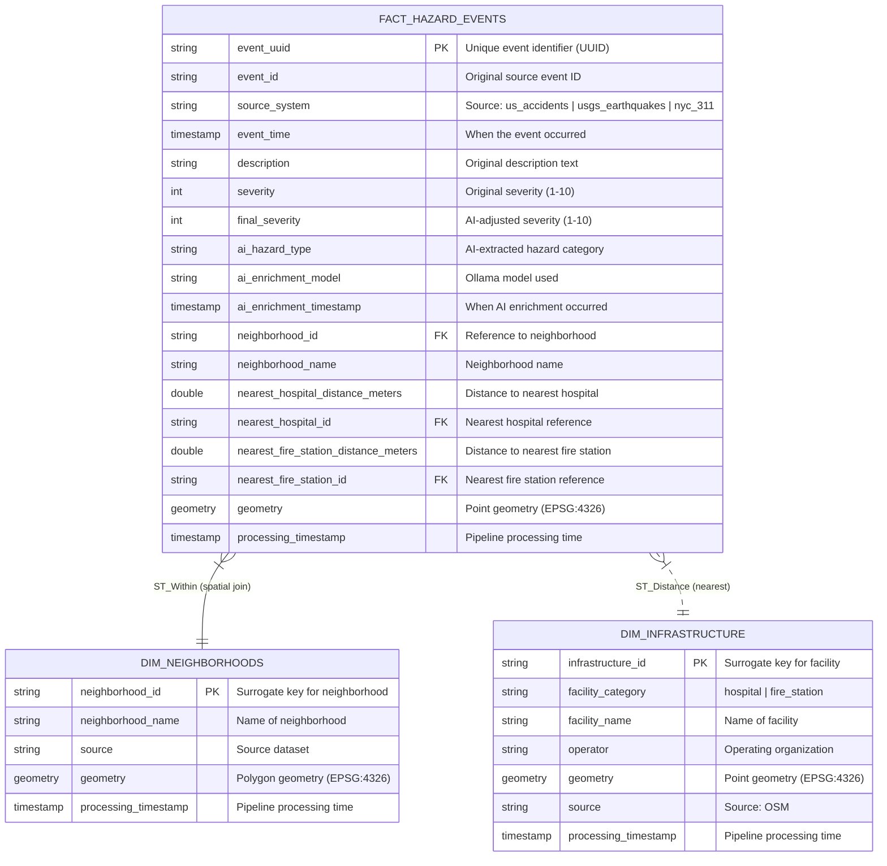

# GeoAI Medallion Architecture - Gold Layer Schema Documentation

## Overview

This document describes the Gold Layer star schema for the GeoAI Medallion Architecture pipeline. The schema is designed for geospatial hazard analysis combining multiple data sources with AI-enriched event data.

---

## Entity-Relationship (ER) Diagram



---

## Table Specifications

### FACT_HAZARD_EVENTS

The central fact table containing all hazard events from multiple sources.

| Column | Type | Description |
|--------|------|-------------|
| `event_uuid` | STRING | Primary key (UUID) |
| `event_id` | STRING | Original source event ID |
| `source_system` | STRING | Source: `us_accidents`, `usgs_earthquakes`, `nyc_311` |
| `event_time` | TIMESTAMP | When the event occurred |
| `description` | STRING | Original text description |
| `severity` | INT | Original severity (1-10) |
| `final_severity` | INT | AI-adjusted severity (1-10) |
| `ai_hazard_type` | STRING | AI-extracted: `traffic`, `weather`, `fire`, `medical`, `infrastructure`, `crime`, `other` |
| `ai_enrichment_model` | STRING | Ollama model used (e.g., `llama3`) |
| `ai_enrichment_timestamp` | TIMESTAMP | When AI enrichment ran |
| `neighborhood_id` | STRING | FK to `DIM_NEIGHBORHOODS` |
| `neighborhood_name` | STRING | Denormalized neighborhood name |
| `nearest_hospital_distance_meters` | DOUBLE | Distance to nearest hospital |
| `nearest_hospital_id` | STRING | FK to `DIM_INFRASTRUCTURE` (hospital) |
| `nearest_fire_station_distance_meters` | DOUBLE | Distance to nearest fire station |
| `nearest_fire_station_id` | STRING | FK to `DIM_INFRASTRUCTURE` (fire_station) |
| `geometry` | GEOMETRY | Point geometry (EPSG:4326) |
| `processing_timestamp` | TIMESTAMP | Pipeline processing time |

**Source Systems:**
- `us_accidents`: US Traffic Accidents (Kaggle)
- `usgs_earthquakes`: USGS Earthquake Hazards (Live API)
- `nyc_311_requests`: NYC 311 Service Requests (Socrata)

---

### DIM_NEIGHBORHOODS

Dimension table containing US neighborhood/city boundary polygons.

| Column | Type | Description |
|--------|------|-------------|
| `neighborhood_id` | STRING | Primary key (surrogate UUID) |
| `neighborhood_name` | STRING | Name of neighborhood |
| `source` | STRING | Source dataset |
| `geometry` | GEOMETRY | Polygon geometry (EPSG:4326) |
| `processing_timestamp` | TIMESTAMP | Pipeline processing time |

**Source:** US City Neighborhood Boundaries (Kaggle GeoJSON)

---

### DIM_INFRASTRUCTURE

Dimension table containing emergency infrastructure (hospitals, fire stations).

| Column | Type | Description |
|--------|------|-------------|
| `infrastructure_id` | STRING | Primary key (surrogate UUID) |
| `facility_category` | STRING | `hospital` or `fire_station` |
| `facility_name` | STRING | Name of facility |
| `operator` | STRING | Operating organization |
| `geometry` | GEOMETRY | Point geometry (EPSG:4326) |
| `source` | STRING | Source: `osm_infrastructure` |
| `processing_timestamp` | TIMESTAMP | Pipeline processing time |

**Source:** OpenStreetMap (OSM) via Overpass API

---

## Data Flow

```
┌─────────────────────────────────────────────────────────────────────────────┐
│                        BRONZE LAYER                                │
│  ┌──────────────┐ ┌──────────────┐ ┌──────────────┐            │
│  │  US Accidents │ │   USGS      │ │   NYC 311    │            │
│  │   (CSV)      │ │ Earthquakes │ │  Requests    │            │
│  │              │ │  (GeoJSON)  │ │   (JSON)     │            │
│  └──────────────┘ └──────────────┘ └──────────────┘            │
└─────────────────────────────────────────────────────────────────────────────┘
                              │
                              ▼
┌─────────────────────────────────────────────────────────────────────────────┐
│                        SILVER LAYER                                 │
│  ┌──────────────┐ ┌──────────────┐ ┌──────────────┐            │
│  │  US Accidents│ │  Earthquakes│ │   NYC 311    │            │
│  │   +Geometry │ │  +Geometry  │ │  +Geometry   │            │
│  │   (Delta)   │ │   (Delta)   │ │   (Delta)    │            │
│  └──────────────┘ └──────────────┘ └──────────────┘            │
│  ┌──────────────────────────────────────────────────────┐        │
│  │ Neighborhoods + GeoJSON → Geometry (Delta)         │        │
│  └──────────────────────────────────────────────────────┘        │
│  ┌──────────────────────────────────────────────────────┐        │
│  │  OSM Infrastructure + Geometry (Delta)             │        │
│  └──────────────────────────────────────────────────────┘        │
└─────────────────────────────────────────────────────────────────────────────┘
                              │
                              ▼
┌─────────────────────────────────────────────────────────────────────────────┐
│                         GOLD LAYER                                  │
│                                                                      │
│   ┌────────────────────────────────────────────────────────────┐    │
│   │              FACT_HAZARD_EVENTS                          │    │
│   │  - Unified from US Accidents + Earthquakes + 311        │    │
│   │  - AI Enrichment (Ollama: severity, hazard_type)       │    │
│   │  - ST_Within → neighborhood_id                        │    │
│   │  - ST_Distance → nearest infrastructure              │    │
│   └────────────────────────────────────────────────────────────┘    │
│                                                                      │
│   ┌──────────────────┐    ┌──────────────────────────┐           │
│   │DIM_NEIGHBORHOODS│    │   DIM_INFRASTRUCTURE   │           │
│   │  - Polygons     │    │   - Hospitals         │           │
│   │  - ST_Within    │    │   - Fire Stations    │           │
│   │    target       │    │   - ST_Distance      │           │
│   └──────────────────┘    │     source          │           │
│                           └──────────────────────────┘           │
└─────────────────────────────────────────────────────────────────────────────┘
```

---

## Spatial Join Relationships

### Relationship 1: ST_Within (Event → Neighborhood)

```sql
-- Join each hazard event to its containing neighborhood
SELECT 
    f.event_uuid,
    f.event_time,
    f.description,
    n.neighborhood_id,
    n.neighborhood_name
FROM fact_hazard_events f
LEFT JOIN dim_neighborhoods n
ON ST_Within(f.geometry, n.geometry)
```

### Relationship 2: ST_Distance (Event → Infrastructure)

```sql
-- Calculate distance to nearest hospital
SELECT 
    f.event_uuid,
    f.event_time,
    i.infrastructure_id AS nearest_hospital_id,
    i.facility_name AS nearest_hospital_name,
    ST_Distance(f.geometry, i.geometry) AS distance_meters
FROM fact_hazard_events f
CROSS JOIN LATERAL (
    SELECT i.* 
    FROM dim_infrastructure i
    WHERE i.facility_category = 'hospital'
    ORDER BY ST_Distance(f.geometry, i.geometry)
    LIMIT 1
) i
```

---

## AI Enrichment Schema

The Ollama integration extracts structured data from free-text descriptions:

### Input
- **Description Column**: Free-text incident descriptions from US Accidents or NYC 311

### Prompt Template
```
Analyze this hazard/incident description and extract:
Return ONLY a JSON object with:
{"severity": 1-10, "hazard_type": "string"}

Where:
- severity: 1=minor to 10=critical
- hazard_type: one of [traffic, weather, fire, medical, infrastructure, crime, other]

Description: {text}

Response:
```

### Output JSON
```json
{
  "severity": 8,
  "hazard_type": "traffic"
}
```

---

## Indexes (Recommended)

For query performance, create indexes on:

```sql
-- On FACT_HAZARD_EVENTS
CREATE INDEX idx_fact_source ON fact_hazard_events(source_system);
CREATE INDEX idx_fact_time ON fact_hazard_events(event_time);
CREATE INDEX idx_fact_severity ON fact_hazard_events(final_severity);
CREATE INDEX idx_fact_neighborhood ON fact_hazard_events(neighborhood_id);

-- On DIM_NEIGHBORHOODS  
CREATE INDEX idx_neighborhood_geom ON dim_neighborhoods USING R-TREE(geometry);

-- On DIM_INFRASTRUCTURE
CREATE INDEX idx_infrastructure_geom ON dim_infrastructure USING R-TREE(geometry);
CREATE INDEX idx_infrastructure_cat ON dim_infrastructure(facility_category);
```

---

## Query Examples

### Query 1: Top Hazard Events by Neighborhood
```sql
SELECT 
    n.neighborhood_name,
    COUNT(*) AS event_count,
    AVG(f.final_severity) AS avg_severity,
    f.ai_hazard_type
FROM fact_hazard_events f
JOIN dim_neighborhoods n ON f.neighborhood_id = n.neighborhood_id
WHERE f.event_time >= '2024-01-01'
GROUP BY n.neighborhood_name, f.ai_hazard_type
ORDER BY event_count DESC
LIMIT 20
```

### Query 2: Events Near Hospitals
```sql
SELECT 
    f.event_uuid,
    f.description,
    f.final_severity,
    f.nearest_hospital_distance_meters
FROM fact_hazard_events f
WHERE f.nearest_hospital_distance_meters < 1000  -- Within 1km
ORDER BY f.nearest_hospital_distance_meters
LIMIT 50
```

---

## Version History

| Version | Date | Changes |
|---------|------|---------|
| 1.0.0 | 2024-04-20 | Initial schema design |
